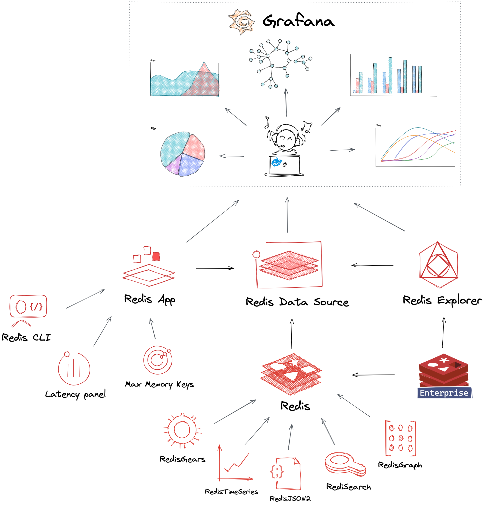

# Redis plugins for Grafana

## Introduction

The Redis plugins for Grafana let you connect Grafana to Redis to visualize more types of data in more ways than otherwise would be possible.

All the increased functionality comes with a more streamlined workflow.

Redis Data Source can connect to any Redis database On-Premises and in the Cloud. The Redis plugins for Grafana ecosystem build on top of the Redis Data Source.

## Requirements

- Grafana 8.0+ is required for Redis plugins 2.X.
- Grafana 7.1+ is required for Redis plugins 1.X.

## Quick Links

- [Redis Data Source for Grafana](https://github.com/RedisGrafana/grafana-redis-datasource)
- [Redis Application plugin](https://github.com/RedisGrafana/grafana-redis-app)
- [Redis Explorer plugin](https://github.com/RedisGrafana/grafana-redis-explorer)
- [Docker images for Development](https://github.com/orgs/RedisGrafana/packages)

## Documentation

- [Introduction](https://redisgrafana.github.io/intro/)
- [Quickstart](https://redisgrafana.github.io/quickstart/)
- [Learn More](https://redisgrafana.github.io/learn-more/)

## License

Redis plugins for Grafana are licensed under the [Apache License Version 2.0](https://github.com/RedisGrafana/RedisGrafana/blob/main/LICENSE).
