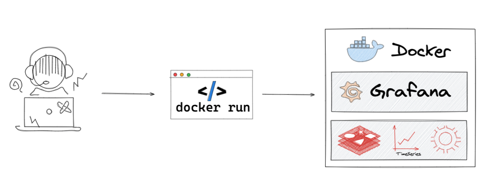

# Docker Images

To try the latest features you can start nightly build Docker image. Supported platforms are:

- linux/amd64
- linux/arm64
- linux/arm

!!! important "Images built from main branch and can be UNSTABLE."



## Redis Application plug-in

The Redis Application, is a plug-in for Grafana that provides application pages and custom panels for Redis Data Source.

```bash
docker run -d -p 3000:3000 --name=redis-app ghcr.io/redisgrafana/redis-app:latest
```

## Redis Explorer plug-in

The Redis Explorer, is a plug-in for Grafana that allows users to connect to Redis Enterprise software clusters using REST API and build dashboards to observe their status.

```bash
docker run -d -p 3000:3000 --name=explorer ghcr.io/redisgrafana/redis-explorer:latest
```
