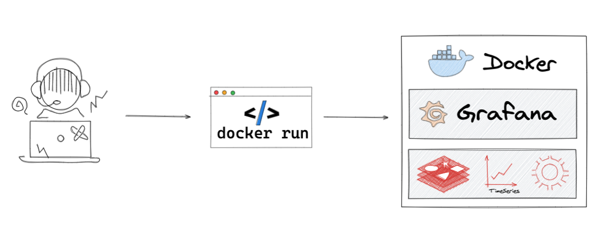

# Docker Images

Interested in the latest features and updates? Start nightly built Docker image. Supported platforms are:

- Linux/amd64
- Linux/arm64
- Linux/arm

!!! important "Unstable"

    Images built from the main branch and recommended for Testing new features and bug fixes only.



## Grafana

--8<-- "includes/login-grafana.md"

--8<-- "includes/docker-background.md"

### Redis Application plugin


The Redis Application is a plugin for Grafana that provides application pages and custom panels for Redis Data Source.

```bash
docker pull ghcr.io/redisgrafana/redis-app:latest && \
docker run -p 3000:3000 --name=redis-app ghcr.io/redisgrafana/redis-app:latest
```

??? bug "Master build"

    Based on Grafana's Master branch.

    ```bash
    docker pull ghcr.io/redisgrafana/redis-app:master && \
    docker run -p 3000:3000 --name=redis-app ghcr.io/redisgrafana/redis-app:master
    ```

### Redis Explorer plugin


The Redis Explorer is a plugin for Grafana that allows users to connect to Redis Enterprise software clusters using REST API and build dashboards to observe their status.

```bash
docker pull ghcr.io/redisgrafana/redis-explorer:latest && \
docker run -p 3000:3000 --name=explorer ghcr.io/redisgrafana/redis-explorer:latest
```

??? bug "Master build"

    Based on Grafana's Master branch.

    ```bash
    docker pull ghcr.io/redisgrafana/redis-explorer:master && \
    docker run -p 3000:3000 --name=redis-app ghcr.io/redisgrafana/redis-explorer:master
    ```

## Redis

### Redis-Prophet

[](https://github.com/RedisGrafana/redis-finance-prophet/actions/workflows/docker.yml)

The Redis-Prophet Docker image is based on the latest version of RedisTimeSeries, RedisGears with Prophet pre-installed and can be used for any time series forecasting project.

```bash
docker pull ghcr.io/redisgrafana/redis-prophet:latest && \
docker run -p 6379:6379 --name=redis-prophet ghcr.io/redisgrafana/redis-prophet:latest
```

### Redis-OpenCV

[](https://github.com/RedisGrafana/redis-camera-ai/actions/workflows/docker.yml)

The Redis-OpenCV Docker image is based on the latest version of RedisTimeSeries, RedisGears with OpenCV pre-installed, RedisAI and can be used for any real-time computer vision projects.

```bash
docker pull ghcr.io/redisgrafana/redis-opencv:latest && \
docker run -p 6379:6379 --name=redis-opencv ghcr.io/redisgrafana/redis-opencv:latest
```
