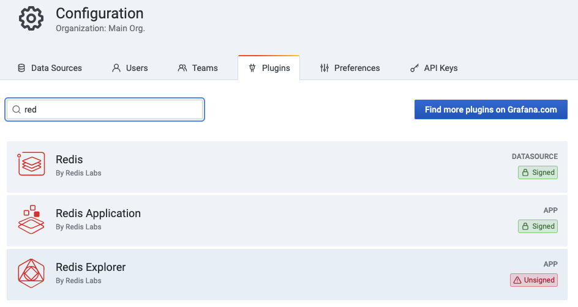
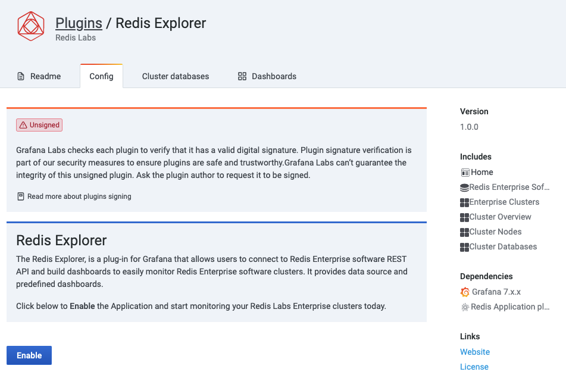

# Developing Redis Explorer plug-in for Grafana


[](https://codecov.io/gh/RedisGrafana/grafana-redis-explorer)

Developing Explorer plug-in involves setting up the development environment (which can be either Linux-based or macOS-based), building and running tests.

## Install Grafana

!!! important "Grafana can be used in Docker or installed locally."

- Follow [Installation instructions](https://grafana.com/docs/grafana/latest/installation/) to install and start Grafana

- Open Grafana UI in web-browser `http://X.X.X.X:3000`

## Clone repository

```bash
git clone https://github.com/RedisGrafana/grafana-redis-explorer.git
```

## Build Explorer

- Install the latest version of Node.js using [Node Version Manager](https://github.com/nvm-sh/nvm) or [download binaries](https://nodejs.org/en/download/)

- Install `yarn` globally

```bash
npm install yarn -g
```

- Install dependencies

```bash
yarn install
```

- Build frontend components

```bash
yarn build
```

## Update local Grafana Configuration

- Move distribution to Grafana's `plugins/` folder

```bash
mv dist/ /var/lib/grafana/plugins/redis-explorer
```

- Add `redis-explorer` to allowed unsigned plugins

```bash
vi /etc/grafana/grafana.ini
```

```
{{ include('redis-explorer-grafana.ini') }}
```

- Verify that plugin is registered

```bash
tail -100 /var/log/grafana/grafana.log
```

## Start using Docker Compose

!!! important "Docker Compose should be pre-installed following [documentation](https://docs.docker.com/compose/install/)."

```
yarn start:dev
```

## Enable Redis Explorer plug-in

!!! important "Redis Explorer plug-in is disabled by default."

Go to `Configuration` -> `Plugins` and choose Redis Explorer plug-in.



Click **Enable** to add side menu, Data Sources and import Dashboards.



## Contact Us

If you have questions, enhancement ideas or running into issues, please open an [issue](https://github.com/RedisGrafana/grafana-redis-explorer/issues/new/choose).
