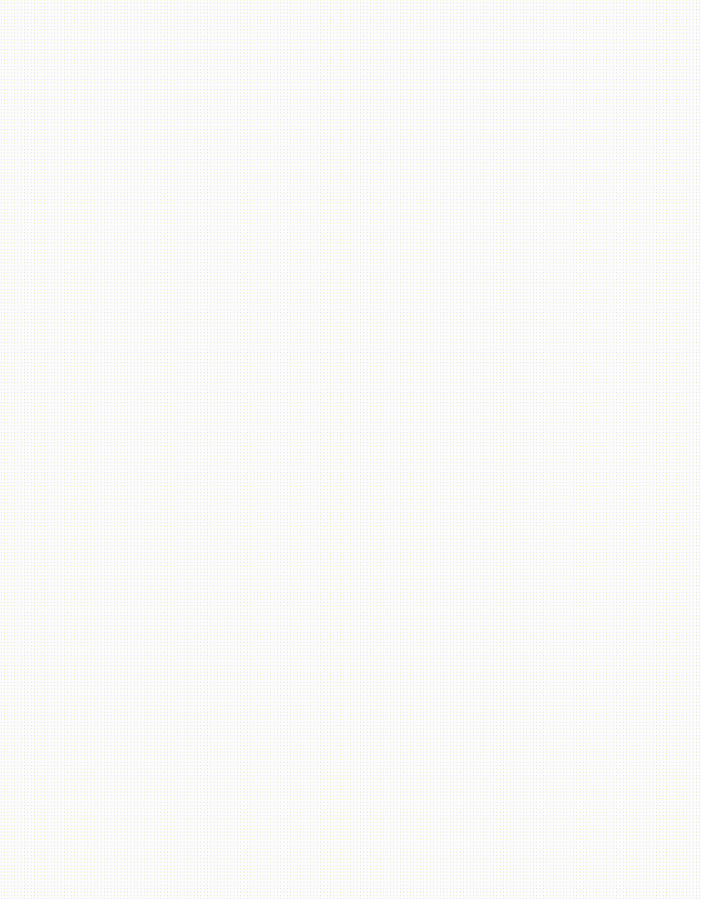

#  Redis plug-ins for Grafana

The Redis plug-ins for Grafana allow users to connect to the Redis databases and build dashboards in Grafana to easily monitor Redis and application data.
Data Source can connect to any Redis database On-Premises or in the Cloud.

!!! important "Plug-ins are registered in the [Grafana repository](https://grafana.com/grafana/plugins/) and available to [Grafana](https://grafana.com/), [Grafana Enterprise](https://grafana.com/products/enterprise/) and [Grafana Cloud](https://grafana.com/products/cloud/)."

## Where Next?

- The [Quickstart](quickstart.md) is the recommended starting point
- The [Configuration](redis-datasource/configuration.md) page explains how to configure Redis Data Source
- The [Commands](redis-datasource/commands.md) reference all supported commands
- The [Custom Panels](redis-app/panels.md) page provides information about all custom panels
- There are predefined dashboards and recipes in the [Dashboards](dashboards.md) page

## Quick Links

- [Redis Data Source for Grafana](https://grafana.com/grafana/plugins/redis-datasource/)
- [Redis Application plug-in](https://grafana.com/grafana/plugins/redis-app/)

## Learn More

- [Introducing the Redis Data Source Plug-in for Grafana](https://redislabs.com/blog/introducing-the-redis-data-source-plug-in-for-grafana/)
- [How to Use the New Redis Data Source for Grafana Plug-in](https://redislabs.com/blog/how-to-use-the-new-redis-data-source-for-grafana-plug-in/)
- [3 Real-Life Apps Built with Redis Data Source for Grafana](https://redislabs.com/blog/3-real-life-apps-built-with-redis-data-source-for-grafana/)
- [Real-time observability with Redis and Grafana](https://grafana.com/go/observabilitycon/real-time-observability-with-redis-and-grafana/)

## Contact Us

If you have questions or feedback, or want to report an issue, here's where you can get in touch:

- [Redis Data Source Issues](https://github.com/RedisGrafana/grafana-redis-datasource/issues/new/choose)
- [Redis Application Issues](https://github.com/RedisGrafana/grafana-redis-app/issues/new/choose)
- [Documentation updates](https://github.com/RedisGrafana/redisgrafana/issues/new/choose)

## License

Redis plug-ins for Grafana are licensed under the [Apache License Version 2.0](https://github.com/RedisGrafana/grafana-redis-datasource/blob/master/LICENSE).
