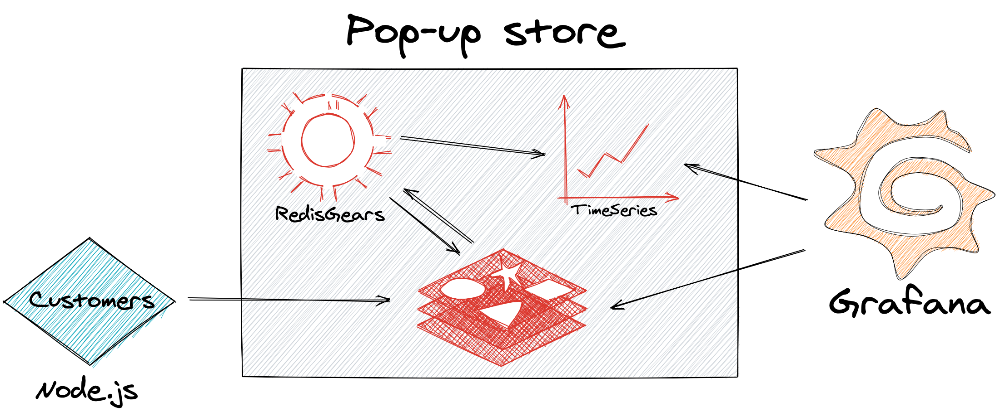

# Projects

The following sections consist of various projects showing the uses for Redis plug-ins for Grafana.

!!! note "Contribute"

    To contibute your project, click the "Edit this page" button at the top to submit a Pull Request.

## How many times Redis Data Source for Grafana was downloaded?

> Earlier this month, Redis Labs released the new Redis Data Source for Grafana plug-in, which connects the widely used open source application monitoring tool to Redis. To give you an idea of how it all works, let’s take a look at a self-referential example: using the plug-in to see how many times it has been downloaded over time. (The Grafana plug-in repository itself does not provide such statistics out of the box.). Read more at [Redis Labs blog](https://redislabs.com/blog/how-to-use-the-new-redis-data-source-for-grafana-plug-in/).

This project collect plug-ins statistics from Grafana repository using [RedisTimeSeries](https://oss.redislabs.com/redistimeseries/):

!!! important "GitHub Repository"

    [https://github.com/RedisGrafana/grafana-plugin-stats](https://github.com/RedisGrafana/grafana-plugin-stats)

## Pop-up store demo using RedisTimeSeries, RedisGears and Redis Data Source

> I am a big fan of Redis Streams, a new data type introduced in Redis 5.0, and I was looking for a fast and simple solution to monitor queues for data processing. While working on the Redis Data Source, our team started to explore RedisGears—a dynamic framework that lets developers write and execute functions that implement data flows in Redis while abstracting away the data’s distribution and deployment—for another project and we decided to use them together for this data-pipeline demo for a pop-up store. Read more at [Redis Labs blog](https://redislabs.com/blog/3-real-life-apps-built-with-redis-data-source-for-grafana/).

The Pop-up store demo is using [Redis Streams](https://redis.io/topics/streams-intro), [RedisTimeSeries](https://oss.redislabs.com/redistimeseries/), [RedisGears](https://oss.redislabs.com/redisgears/) and [Redis Data Source](https://github.com/RedisTimeSeries/grafana-redis-datasource) to visualize real-time data pipeline in Grafana.

!!! important "GitHub Repository"

    [https://github.com/RedisTimeSeries/redis-pop-up-store](https://github.com/RedisTimeSeries/redis-pop-up-store)
