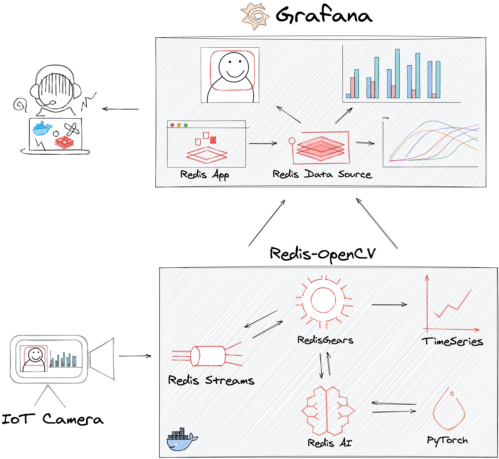
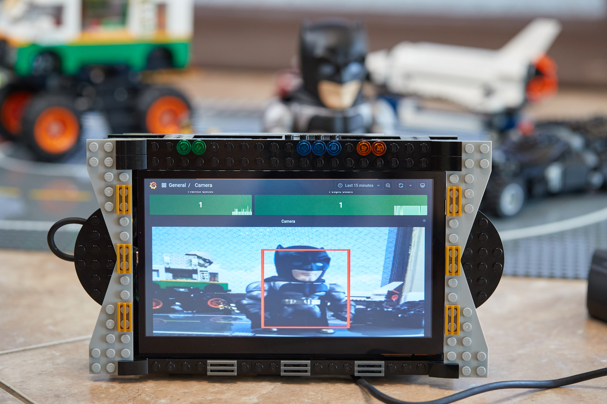
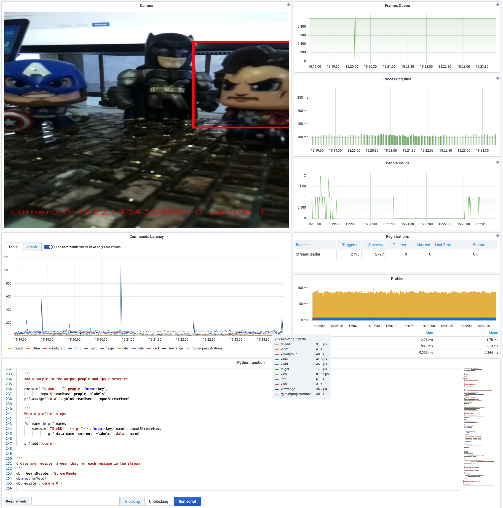

# Analyzing camera feed using RedisAI, OpenCV, and Redis plugins for Grafana

This project demonstrates how to analyze camera feed stored as [Redis Streams](https://redis.io/topics/streams-intro) using serverless engine [RedisGears](https://oss.redislabs.com/redisgears/), [RedisAI](https://redisai.io/) and display analyzed frames with metrics in Grafana.

!!! important "GitHub Repository"

    [https://github.com/RedisGrafana/redis-camera-ai](https://github.com/RedisGrafana/redis-camera-ai)

## Description

!!! quote "Analyzing camera feed using RedisAI, OpenCV, and Redis plugins for Grafana"

    Two years ago, Redis Labs published an article "My Other Stack Is RedisEdge" introducing real-time video analysis in Redis. Since then, we introduced Redis plugins for Grafana to visualize RedisTimeSeries directly without adapters for Prometheus. Also, a recently developed Image panel can display analyzed with AI encoded image on the dashboard, eliminating the Video server.

## Dashboard

Camera processing dashboard with panels vizualizing Frames Queue, Processing Queue, Profile and allows to monitor and update RegisGears script.

