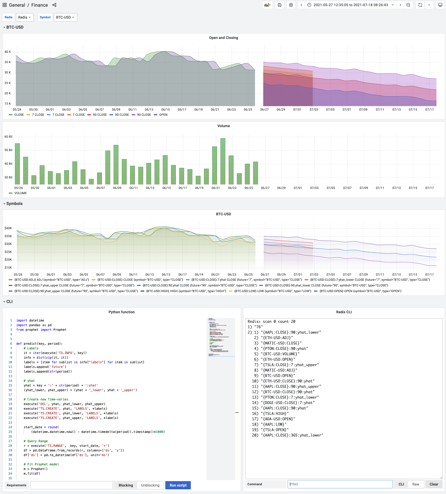

# Forecasting Stocks and Crypto prices using Redis, Prophet and Grafana

This project demonstrates how to analyze Stocks and Crypto historical data stored as [RedisTimeSeries](https://oss.redis.com/redistimeseries/) using serverless engine [RedisGears](https://oss.redis.com/redisgears/), [Facebook’s Prophet Model](https://facebook.github.io/prophet/) to predict prices and [Redis Data Source](https://github.com/RedisTimeSeries/grafana-redis-datasource) to visualize time series with predictions in Grafana.

!!! important "GitHub Repository"

    [https://github.com/RedisGrafana/redis-finance-prophet](https://github.com/RedisGrafana/redis-finance-prophet)

## Description

!!! quote "Forecasting Stocks and Crypto prices using Redis, Prophet, and Grafana"

    Redis announced RedisGears 1.0 in May last year, and one of the examples was the ProphetGears project, visualizing RedisTimeSeries with RedisInsight, which was the only option at that time. I already wrote about adopting RedisGears for other projects but have not had a chance to try it with Prophet until now. Prophet team recently (March 28, 2021) released Version 1.0 with many improvements, and I am excited to play with it.

    Read more at [Volkov Labs blog](https://volkovlabs.com/forecasting-stocks-and-crypto-prices-using-redis-prophet-and-grafana-b1630638d469).

