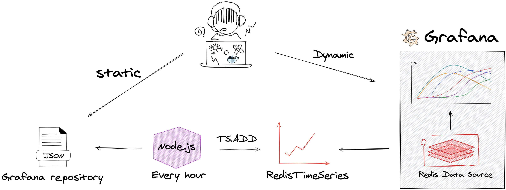
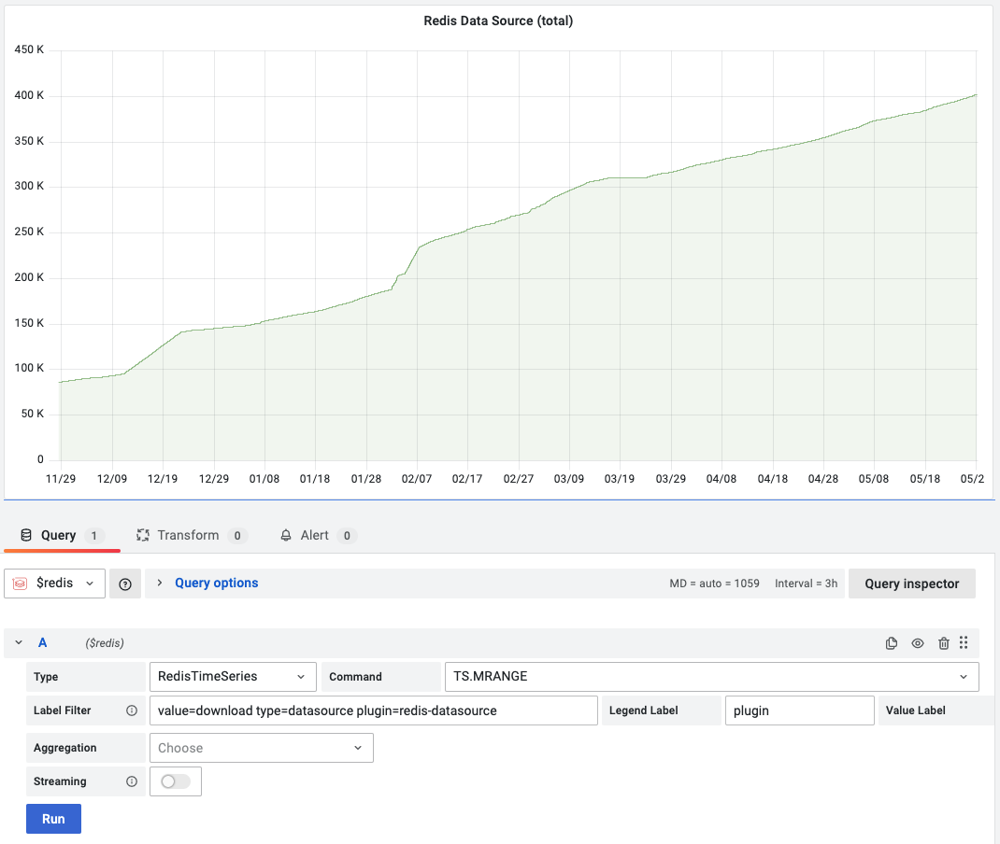
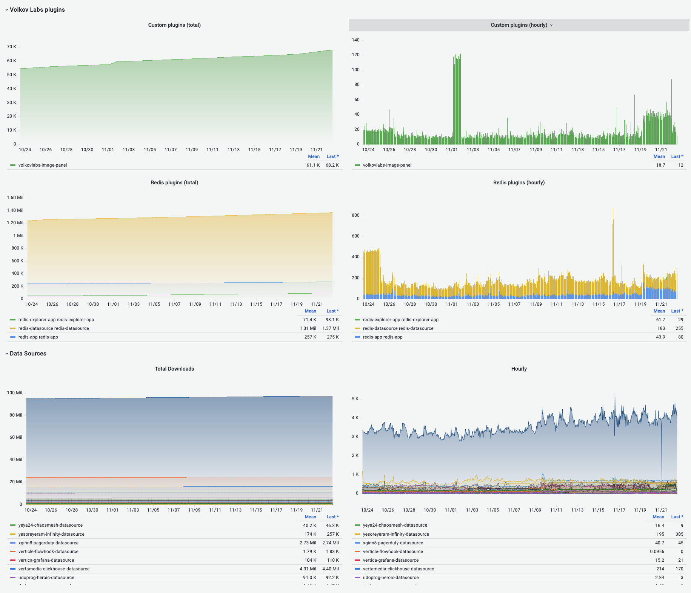

# Collecting Grafana Plugins Statistics as RedisTimeSeries and visualizing time series using Redis plugins for Grafana

This project collects plugins statistics from Grafana marketplace using [RedisTimeSeries](https://oss.redis.com/redistimeseries/) and [RedisJSON](https://oss.redis.com/rejson/).

!!! important "Links"

    Demo: [Grafana Plugins](https://demo.volkovlabs.io/d/hHK1qmpnk/grafana-plugins), [Grafana Plugins Downloads](https://demo.volkovlabs.io/d/C1NCSr3Gk/grafana-plugins-downloads)

    GitHub Repository: [RedisGrafana/grafana-plugin-stats](https://github.com/RedisGrafana/grafana-plugin-stats)

## Description

!!! quote "How to Use the New Redis Data Source for Grafana Plugin"

    Earlier this month, Redis released the new Redis Data Source for Grafana plugin, which connects the widely used open source application monitoring tool to Redis. To give you an idea of how it all works, let’s take a look at a self-referential example: using the plugin to see how many times it has been downloaded over time. (The Grafana plugin repository itself does not provide such statistics out of the box.).

    Read more at [Redis blog](https://redis.com/blog/how-to-use-the-new-redis-data-source-for-grafana-plug-in/).

## Downloads Dashboard

A new dashboard for Grafana v8 with Time Series panels was recently added to the project:

