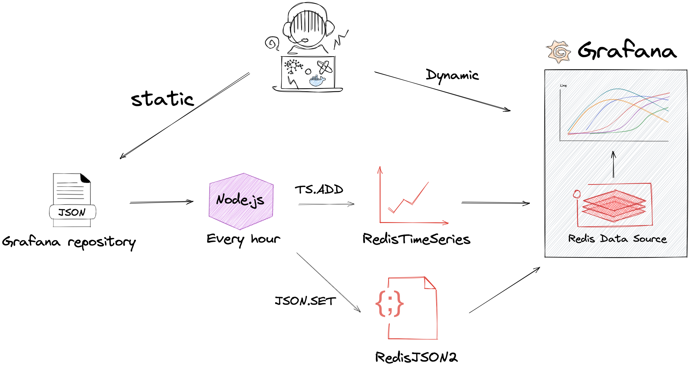

# Grafana Plug-ins Statistics

This project collects plug-ins statistics from Grafana repository using [RedisTimeSeries](https://oss.redislabs.com/redistimeseries/).

!!! important "GitHub Repository"

    [https://github.com/RedisGrafana/grafana-plugin-stats](https://github.com/RedisGrafana/grafana-plugin-stats)

## Description

!!! quote "How to Use the New Redis Data Source for Grafana Plug-in"

    Earlier this month, Redis Labs released the new Redis Data Source for Grafana plug-in, which connects the widely used open source application monitoring tool to Redis. To give you an idea of how it all works, let’s take a look at a self-referential example: using the plug-in to see how many times it has been downloaded over time. (The Grafana plug-in repository itself does not provide such statistics out of the box.).

    Read more at [Redis Labs blog](https://redislabs.com/blog/how-to-use-the-new-redis-data-source-for-grafana-plug-in/).

