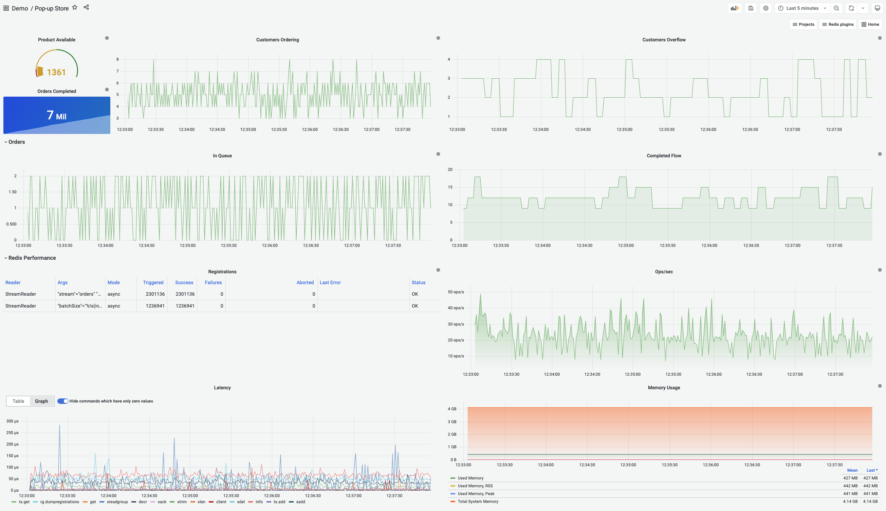

# Pop-up store demo using RedisTimeSeries, RedisGears and Redis Data Source

The Pop-up store demo is using [Redis Streams](https://redis.io/topics/streams-intro), [RedisTimeSeries](https://oss.redis.com/redistimeseries/), [RedisGears](https://oss.redis.com/redisgears/) and Redis plugins to visualize real-time data pipeline in Grafana.

!!! important "Links"

    Demo: [Pop-up Store](https://demo.volkovlabs.io/d/0LC0Sm7Ml/pop-up-store)

    GitHub Repository: [RedisGrafana/redis-pop-up-store](https://github.com/RedisGrafana/redis-pop-up-store)

## Description

!!! quote "3 Real-Life Apps Built with Redis Data Source for Grafana"

    I am a big fan of Redis Streams, a new data type introduced in Redis 5.0, and I was looking for a fast and simple solution to monitor queues for data processing. While working on the Redis Data Source, our team started to explore RedisGears—a dynamic framework that lets developers write and execute functions that implement data flows in Redis while abstracting away the data’s distribution and deployment—for another project and we decided to use them together for this data-pipeline demo for a pop-up store.

    Read more at [Redis blog](https://redis.com/blog/3-real-life-apps-built-with-redis-data-source-for-grafana/).

## Streaming dashboard

A new dashboard with streaming time series panels was recently added to the project:

