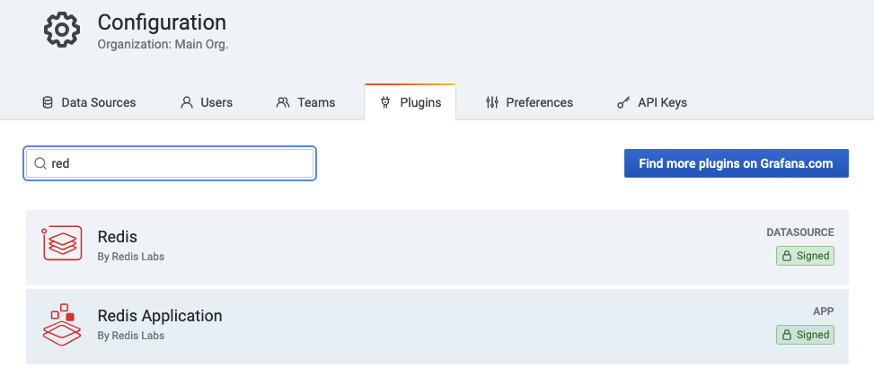
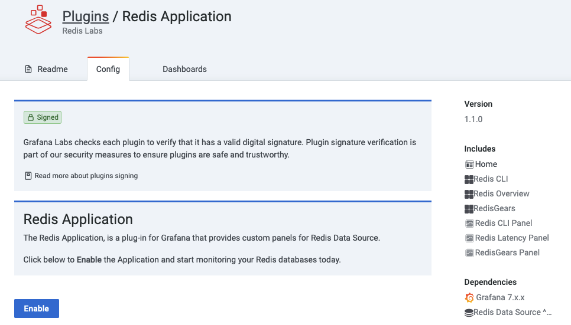

# Quickstart

!!! important "Only Grafana 7.1 and later with a new plug-in platform supported."

## Install using `grafana-cli`

Use the `grafana-cli` tool to install from the commandline.

### Redis Application plug-in and Redis Data Source

```bash
grafana-cli plugins install redis-app
```

### Redis Data Source

```bash
grafana-cli plugins install redis-datasource
```

## Run using `Docker`

!!! note "Username and password to login to Grafana is `admin`/`admin`."

### Redis Application plug-in and Redis Data Source

```bash
docker run -d -p 3000:3000 --name=grafana -e "GF_INSTALL_PLUGINS=redis-app" grafana/grafana
```

### Redis Data Source

```bash
docker run -d -p 3000:3000 --name=grafana -e "GF_INSTALL_PLUGINS=redis-datasource" grafana/grafana
```

## Enable Redis Application plug-in

!!! important "Redis Application plug-in is disabled by default."

Go to `Configuration` -> `Plugins` and choose Redis Application plug-in.



Click **Enable** to add side menu, [Custom panels](redis-app/panels.md) and import [Dashboards](redis-app/dashboards.md).



## Configuration

### Redis Data Source

!!! note "The [Redis Data Source Configuration](redis-datasource/configuration.md) page explains how to connect data source to Redis database."
