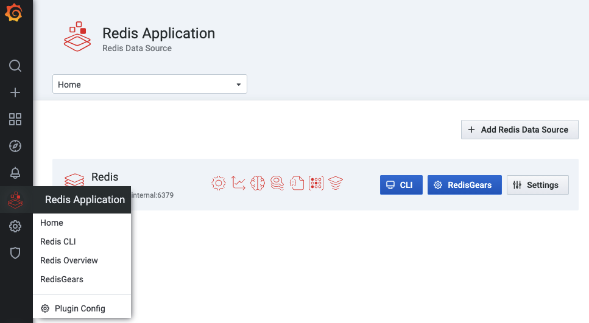
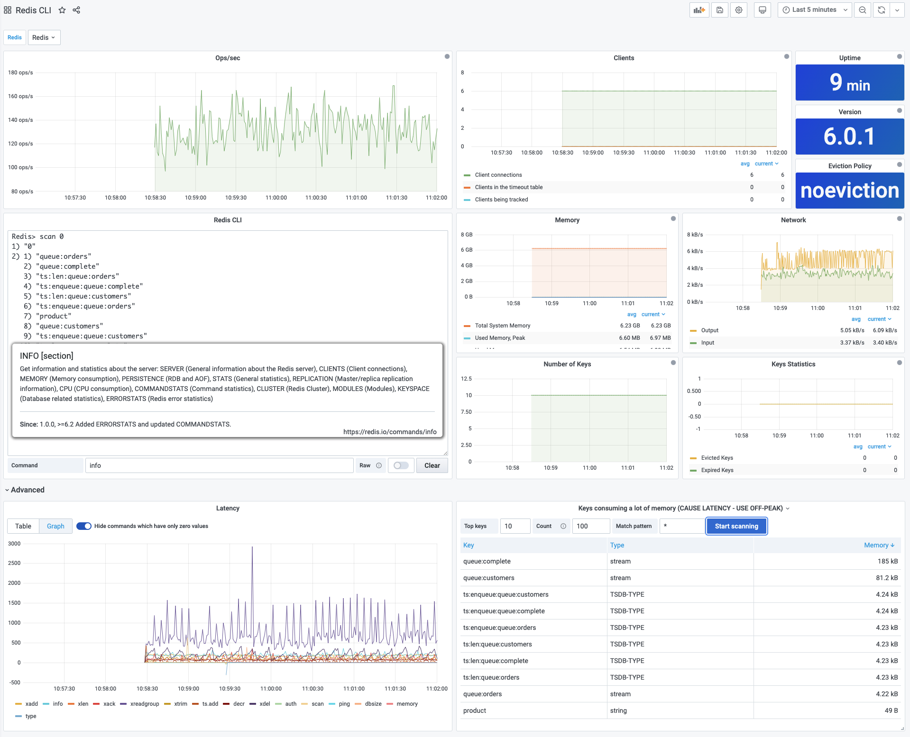
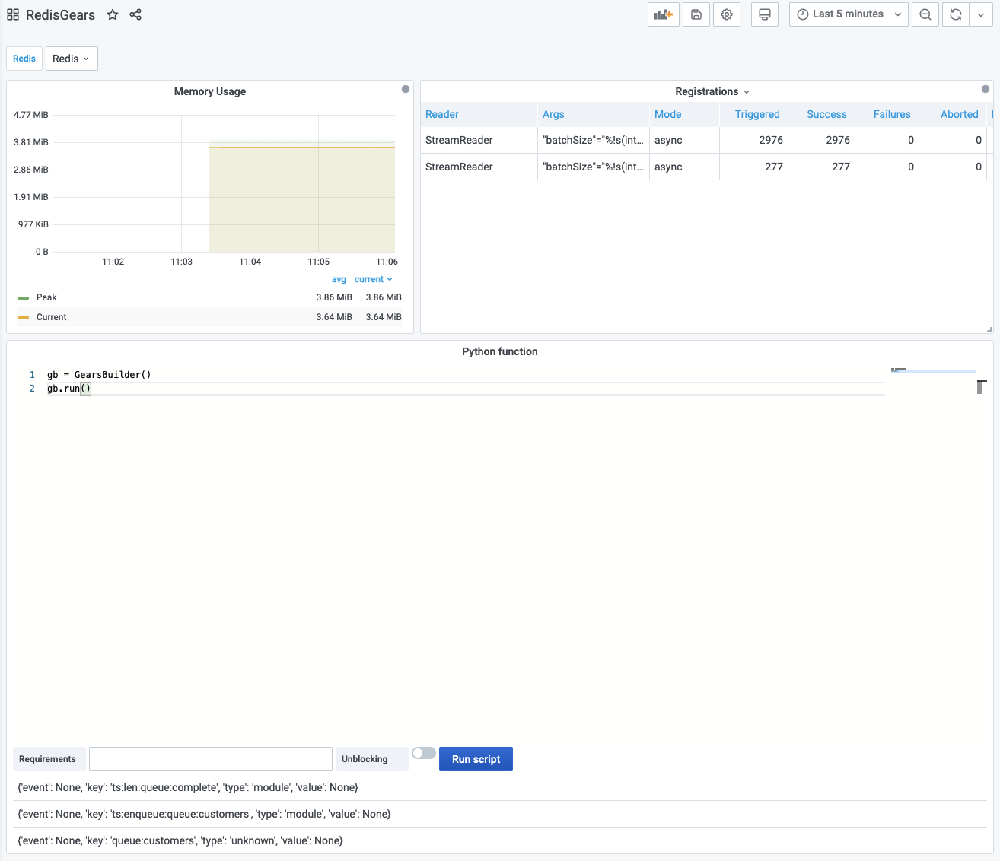

# Dashboards

Redis Application plug-in includes three dashboards:

- CLI (Command line interface)
- Redis Overview
- RedisGears

!!! important "All dashboards are available from the Application's icon in the left side menu."

## CLI (Command line interface)

!!! note "All panels are running in [Streaming](../redis-datasource/streaming.md) mode."

### Included panels

- Operations per second (Streaming)
- Connected clients
- [CLI panel](redis-cli-panel.md)
- Number of Keys, Expired and Evicted Keys
- Network (Inbound, Outbound)
- Memory (Used Memory, Used Memory Peak, LUA, Memory Limit, and Total System memory)
- Uptime and Version
- Eviction Policy

## Redis Overview

!!! note "Overview dashboard refreshes every 10 seconds."

### Included panels

- Operations per second
- Connected clients
- Number of Keys, Expired and Evicted Keys
- Network (Inbound, Outbound)
- Memory (Used Memory, Used Memory Peak and LUA, Memory Limit and Total System memory)
- Uptime and Version
- Eviction Policy
- Client connections
- Command statistics
- Slow queries log
- Redis cluster health and nodes

## RedisGears

> RedisGears is a serverless engine for transaction, batch and event-driven data processing in Redis. Learn more at [Project page](https://oss.redislabs.com/redisgears/).

### Included panels

- RedisGears Memory Usage
- [Registrations](https://oss.redislabs.com/redisgears/functions.html#execution)
- [RedisGears script editor](redis-gears-panel.md)
