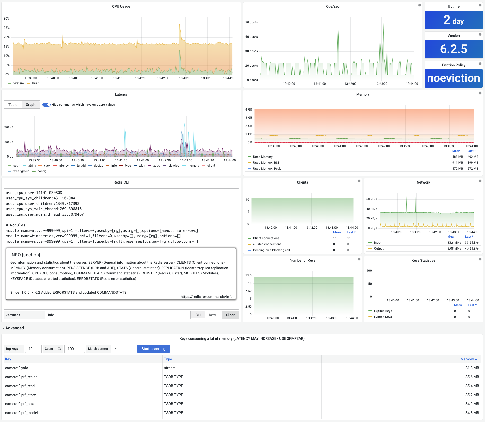
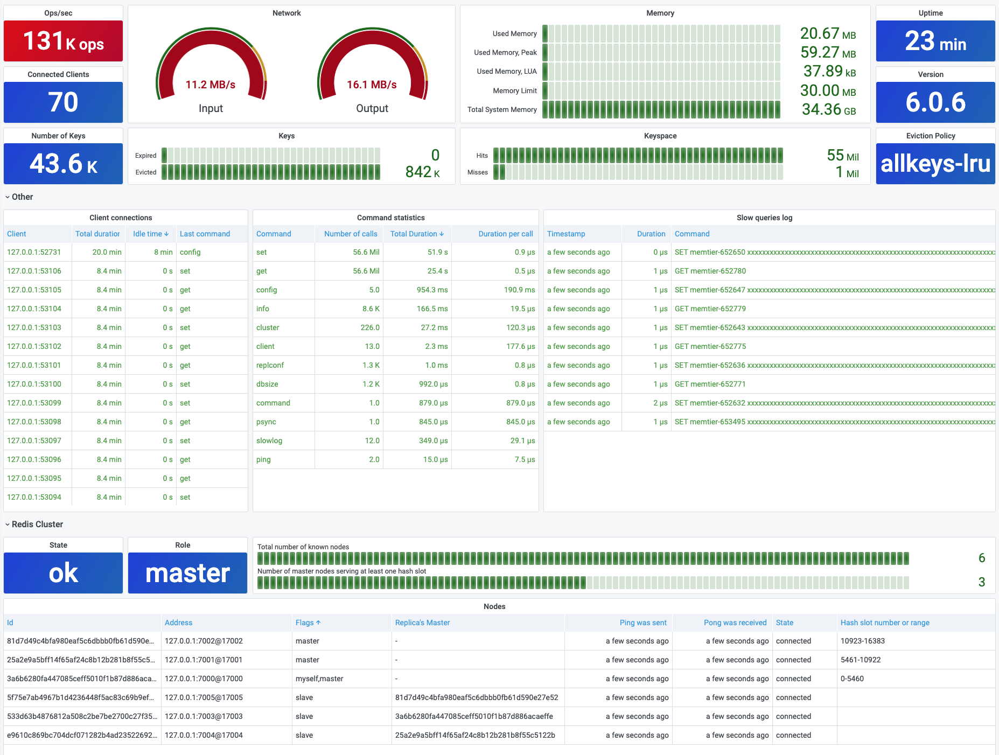

# Dashboards

Redis Application plug-in includes three dashboards:

- CLI (Command line interface)
- Redis Overview
- RedisGears

!!! important "Application Icon"

    All dashboards are accessible from the Application's icon in the left side menu.

## CLI (Command line interface)

!!! note "Streaming"

    All panels are running in [Streaming](../redis-datasource/streaming.md) mode.

### Panels

- Operations per second (Streaming)
- Connected clients
- [CLI panel](redis-cli-panel.md)
- Number of Keys, Expired and Evicted Keys
- Network (Inbound, Outbound)
- Memory (Used Memory, Used Memory Peak, LUA, Memory Limit, and Total System memory)
- Uptime and Version
- Eviction Policy

## Redis Overview

!!! note "Refresh"

    Overview dashboard refreshes every 10 seconds.

### Panels

- Operations per second
- Connected clients
- Number of Keys, Expired and Evicted Keys
- Network (Inbound, Outbound)
- Memory (Used Memory, Used Memory Peak and LUA, Memory Limit and Total System memory)
- Uptime and Version
- Eviction Policy
- Client connections
- Command statistics
- Slow queries log
- Redis cluster health and nodes

## RedisGears

RedisGears is a serverless engine for transaction, batch and event-driven data processing in Redis. Learn more at [RedisGears project page](https://oss.redislabs.com/redisgears/).

### Panels

- RedisGears Memory Usage
- Registrations
- [RedisGears script editor](redis-gears-panel.md)
