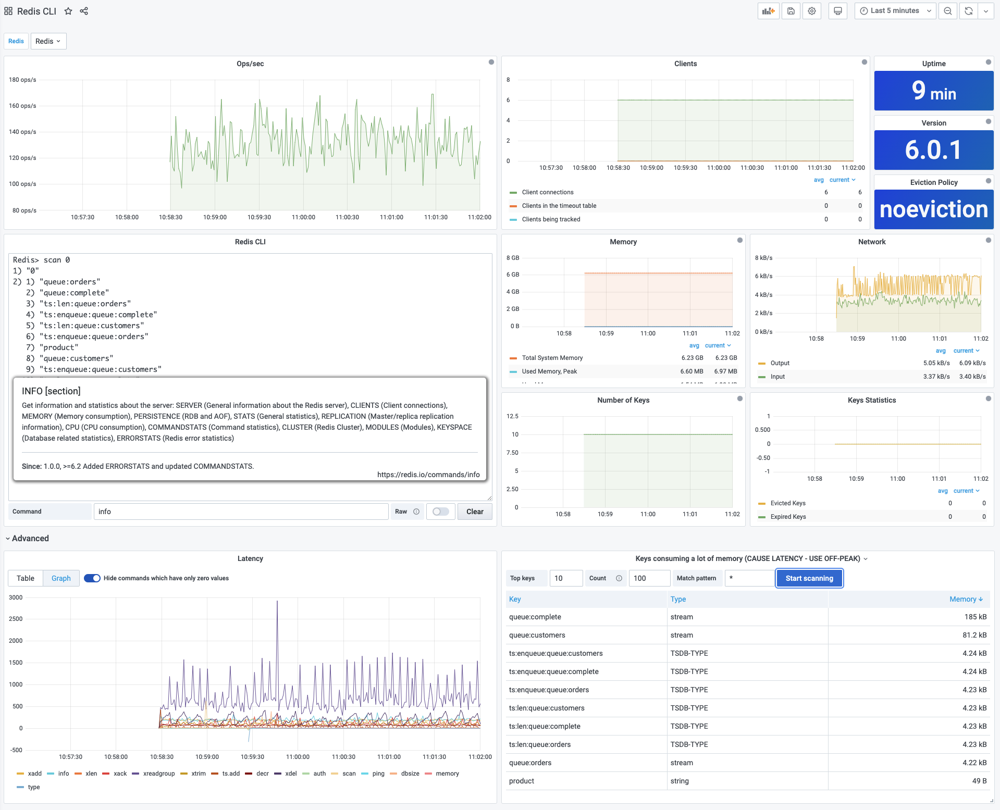

# CLI (Command Line Interface)

!!! note "Streaming"

    All panels are running in [Streaming](../../redis-datasource/streaming.md) mode.

## Panels

- Operations per second
- Connected clients
- [CLI panel](../panels/redis-cli-panel.md)
- Number of Keys, Expired and Evicted Keys
- Network (Inbound, Outbound)
- Memory (Used Memory, Used Memory Peak, LUA, Memory Limit, and Total System memory)
- Uptime and Version
- Eviction Policy
