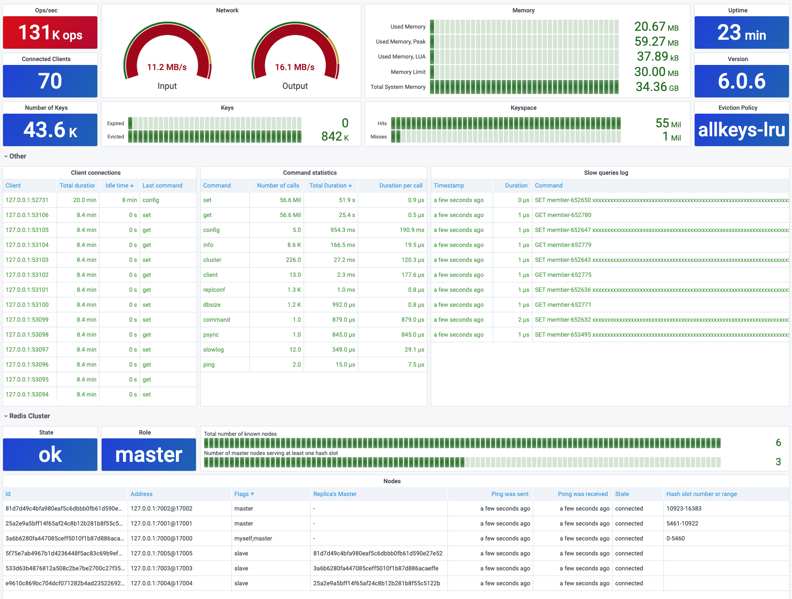

# Redis Overview

!!! note "Refresh"

    Overview dashboard refreshes every 10 seconds.

### Panels

- Operations per second
- Connected clients
- Number of Keys, Expired and Evicted Keys
- Network (Inbound, Outbound)
- Memory (Used Memory, Used Memory Peak and LUA, Memory Limit and Total System memory)
- Uptime and Version
- Eviction Policy
- Client connections
- Command statistics
- Slow queries log
- Redis cluster health and nodes
