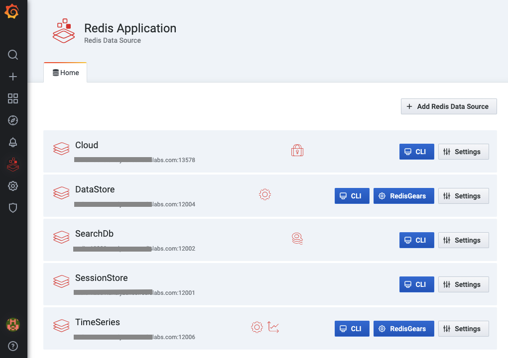

# Manage Redis Data Sources

Redis Application plug-in helps to manage Redis Data Sources and open [CLI](dashboards.md#cli-command-line-interface) and [RedisGears](dashboards.md#redisgears) dashboards from a single page.

Home page connects to every configured data source and check available Redis Modules using `command` command.

!!! note "Page refresh can be delayed if data source are located far away from Grafana or Redis Data Source can't connect to the database."

## Add Redis Data Source

To add Redis Data Source click on **Add Redis Data Source** and configure data source following [Configuration](../redis-datasource/configuration.md) page.
