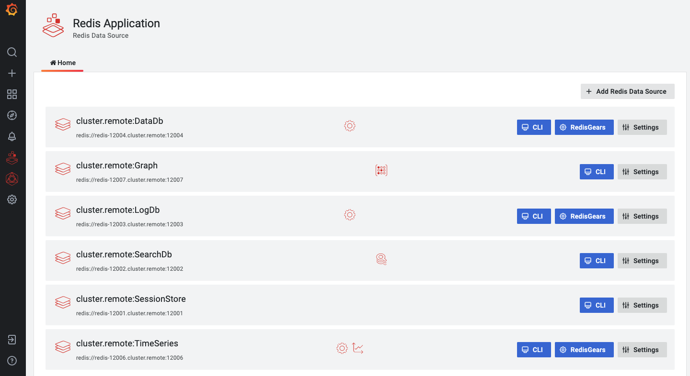

# Redis Application plug-in

 

The Redis Application is a plug-in for Grafana that provides application pages and custom panels for Redis Data Source.

Plug-in's **Home** page helps to manage Redis Data Sources and provides quick access to dashboards.

## Home

The **Home** page connects to every configured data source and checks available Redis Modules using the `command` command.

!!! important "Loading Time"

    Page load can take a long time if data sources located far away from Grafana or Redis Data Source can't connect to the database.

### Add Redis Data Source

To add Redis Data Source click on **Add Redis Data Source** and configure data source following [Configuration](../redis-datasource/configuration.md) page.

## Dashboards

Redis Application plug-in includes predefined dashboards:

- [CLI (Command Line Interface)](dashboards/cli.md)
- [Redis Overview](dashboards/overview.md)
- [RedisGears](dashboards/redis-gears.md)

!!! important "Application Icon"

    All dashboards are accessible from the Application's icon in the left side menu.

## Custom panels

Redis Application plug-in provides custom panels for Redis Data Source:

- [Command line interface (CLI)](panels/redis-cli-panel.md)
- [Command Latency](panels/redis-latency-panel.md)
- [Keys consuming a lot of memory](panels/redis-keys-panel.md)
- [RedisGears Script Editor](panels/redis-gears-panel.md)
