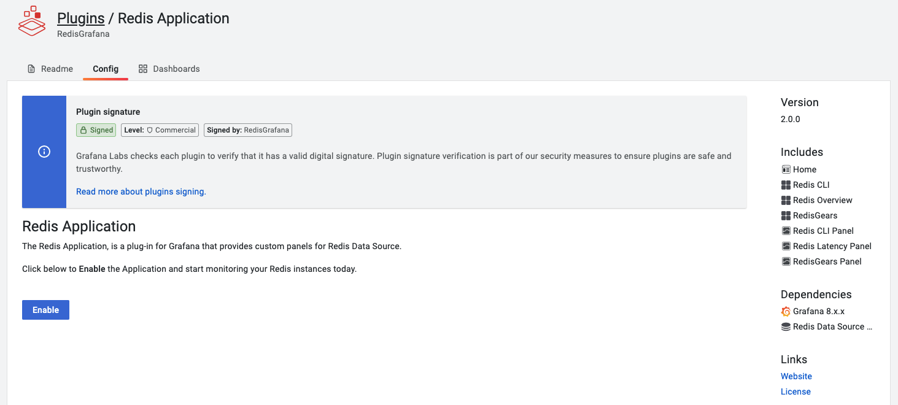

# Redis Application plugin

The Redis Application is a plugin for Grafana that provides application pages, dashboards and custom panels for Redis Data Source. The [Home](#home) page helps to manage Redis Data Sources and provides quick access to dashboards.

<figure>
  
  <figcaption>Redis Application plugin architecture</figcaption>
</figure>

## Quickstart

To learn how to install Redis Application plugin using `grafana-cli`, run using Docker or manually without Internet access follow the [Quickstart](../quickstart.md) page.

## Enable Plugin

The Redis Application plugin is disabled after installation by default. To enable:

- Go to `Configuration` -> `Plugins` and choose Redis Application plugin.

- Click **Enable** to add side menu, Custom panels and import Dashboards.

## Home

The **Home** page connects to every configured data source and checks available Redis Modules using the `command` command.

!!! important "Loading Time"

    Page load can take a long time if databases located far away from Grafana or data source can't connect (timeout).

### Add Redis Data Source

To add Redis Data Source click on **Add Redis Data Source** and configure data source following [Configuration](../redis-datasource/configuration.md) page.

## Dashboards

Redis Application plugin includes predefined dashboards:

- [CLI (Command Line Interface)](dashboards/cli.md)
- [Redis Overview](dashboards/overview.md)
- [RedisGears](dashboards/redis-gears.md)

!!! important "Application Icon"

    All dashboards are accessible from the Application's icon in the left side menu.

## Custom panels

Redis Application plugin provides custom panels for Redis Data Source:

- [Command line interface (CLI)](panels/redis-cli-panel.md)
- [Command Latency](panels/redis-latency-panel.md)
- [Keys consuming a lot of memory](panels/redis-keys-panel.md)
- [RedisGears Script Editor](panels/redis-gears-panel.md)

## Provisioning

Grafana supports managing plugins in Grafana by [adding one or more YAML config files](https://grafana.com/docs/grafana/latest/administration/provisioning/) in the **provisioning/plugins** directory:

- Each config file can contain a list of apps that will be updated during start up.
- Grafana updates each app to match the configuration file.

---8<-- "includes/redis-app/provisioning-yaml.md"
