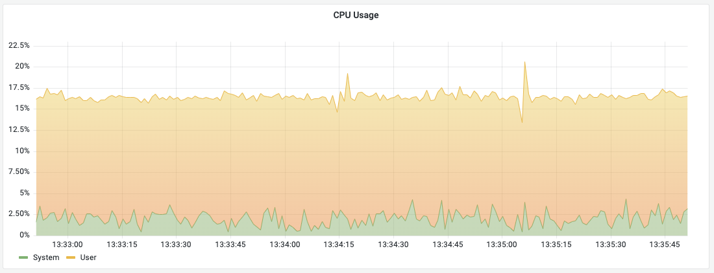

# CPU Usage

This panel provide CPU Usage based on the [INFO CPU](../../redis-datasource/redis/INFO.md) command.

!!! note "Redis Enterprise"

    Redis Enterprise does not expose CPU information for individual shards and this panel is not supported.

## Query Editor

- Data Source should be selected as variable or exact name.
- Query is not required.

## Options

| Option   | Description                      |
| -------- | -------------------------------- |
| Interval | Interval to run INFO command, ms |
| Samples  | Number of Samples                |

## Dashboard

- [Redis CLI](../dashboards/cli.md) includes this panel.
