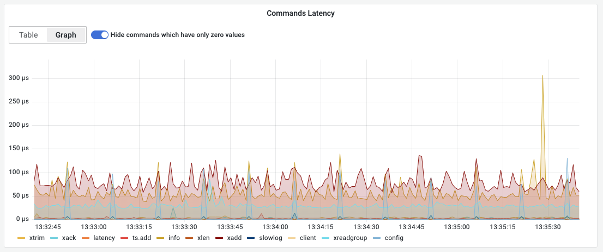
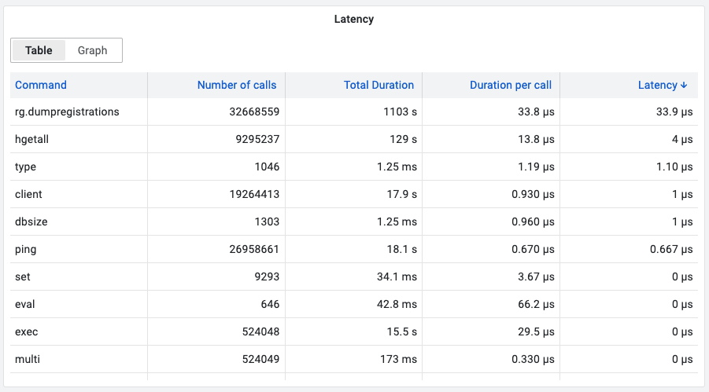

# Command Latency

This panel provides commands's latency based on [INFO COMMANDSTATS](../../redis-datasource/redis/INFO.md).

> Redis is often used in the context of demanding use cases, where it serves a large number of queries per second per instance, and at the same time, there are very strict latency requirements both for the average response time and for the worst case latency.

## Query Editor

- Data Source should be selected as variable or exact name.
- Query is not required.

## Options

| Option          | Description                               |
| --------------- | ----------------------------------------- |
| Interval        | Interval to run INFO command, ms          |
| View mode       | Table or Graph                            |
| Samples (Graph) | Number of Samples per command             |
| Empty (Graph)   | Hide commands which have only zero values |

### Graph view

### Table view

## Dashboard

- [Redis CLI](../dashboards/cli.md) includes this panel.
