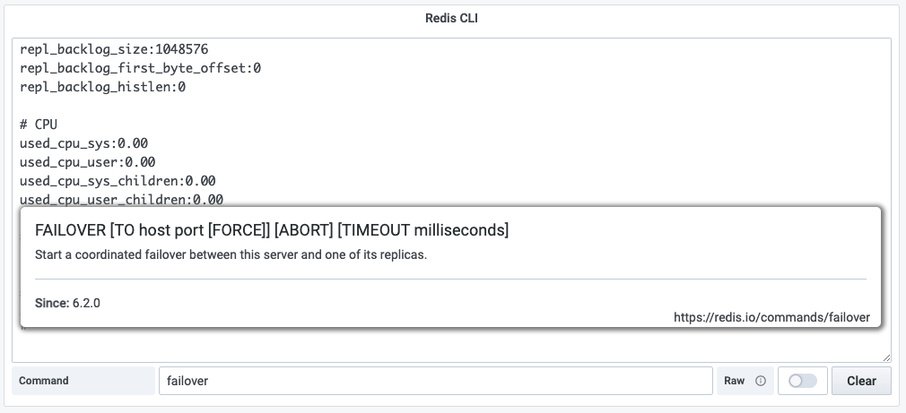

# Command line interface (CLI)

This panel provides [Redis command line interface](https://redis.io/topics/rediscli) that allows to send commands to Redis, and read the replies sent by the server, directly from the Grafana.

!!! tip "Help"

    When typing any Redis command or module name, brief description will appear on the panel. To learn more and see detailed description, click on the link in the bottom right corner of the help.

## Query Editor

- Data Source should be selected as variable or exact name.
- Query is not required.

## Options

| Option | Description                                |
| ------ | ------------------------------------------ |
| Raw    | If enabled, use Raw formatting for replies |

!!! note "Output"

    Output is saved as panel's option and can be cleared using **Clear** button.

## Dashboard

This panel is included in the [Redis CLI dashboard](dashboards.md).
