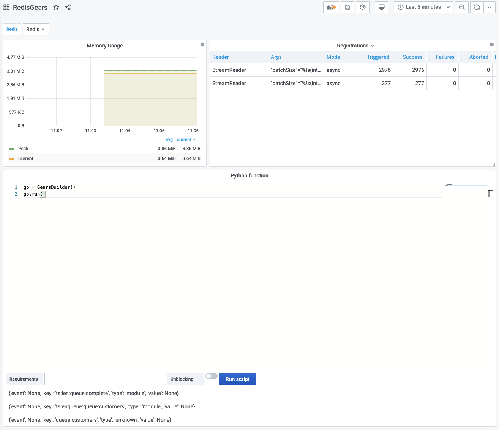

# RedisGears Script Editor

[RedisGears](https://oss.redislabs.com/redisgears/) is a dynamic framework that enables developers to write and execute functions that implement data flows in Redis, while abstracting away the data’s distribution and deployment.

## Execute

This panel support Python syntax and allows to execute functions in blocking and unblocking modes.

## Dashboard

This panel is included in [Redis Gears dashboard](dashboards.md).
