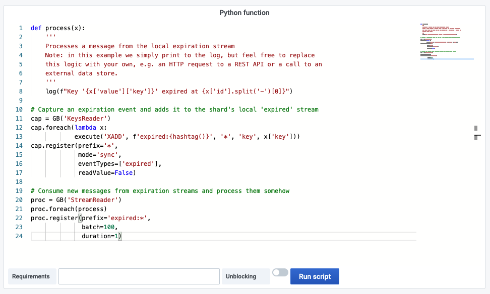

# RedisGears Script Editor

This panel support Python syntax and allows to execute functions in blocking and unblocking modes using RG.PYEXECUTE command.

> [RedisGears](https://oss.redislabs.com/redisgears/) is a dynamic framework that enables developers to write and execute functions that implement data flows in Redis, while abstracting away the data’s distribution and deployment.

## Query Editor

- Data Source should be selected as variable or exact name.
- Query is not required.

## Options

| Option       | Description                                                                                              |
| ------------ | -------------------------------------------------------------------------------------------------------- |
| Function     | Python function                                                                                          |
| Requirements | Ensures that list of dependencies it is given as an argument is installed on each shard before execution |
| Unblocking   | Doesn't block the client during execution                                                                |

## Dashboard

- [RedisGears](dashboards.md) includes this panel.
