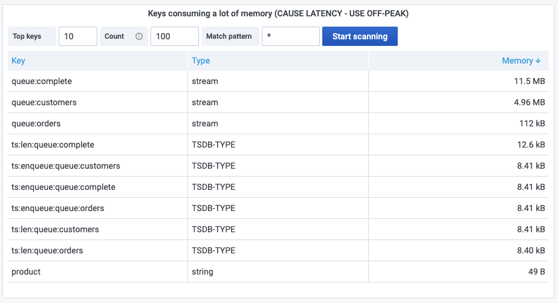

# Keys consuming a lot of memory

Do you want to know which keys consume a lot of memory in your Redis database? This panel is based on [TMSCAN](../redis-datasource/custom/TMSCAN.md) to scan keys and sort results based on memory usage in the table format.

!!! warning "Latency"

    Please use this command in OFF-PEAK as it cause latency increase.

## Options

Interval and count for SCAN command is configurable to keep latency under control.

## Dashboard

This panel is included in [Redis CLI dashboard](dashboards.md).
