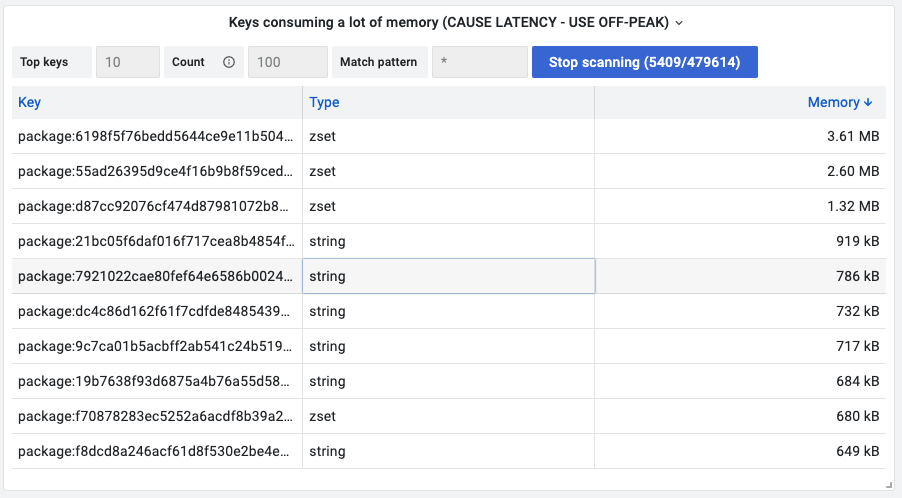

# Keys consuming a lot of memory

Do you want to know which keys consume a lot of memory in your Redis database? This panel is based on [TMSCAN](../redis-datasource/custom/TMSCAN.md) to scan keys and sort results based on memory usage in the table format.

!!! warning "Latency"

    Please use this command in OFF-PEAK as it cause latency increase.

    Interval and count for SCAN command is configurable to keep latency under control.

## Query Editor

- Data Source should be selected as variable or exact name.
- Query is not required.

## Options

| Option        | Description                                                                                                             |
| ------------- | ----------------------------------------------------------------------------------------------------------------------- |
| Interval      | Interval to run SCAN command, ms                                                                                        |
| Top Keys      | Calculate top keys in the results                                                                                       |
| Count         | The amount of work that should be done at every call in order to retrieve elements from the collection for SCAN command |
| Match pattern | Patter for SCAN command                                                                                                 |

## Dashboard

- [Redis CLI](dashboards.md) includes this panel.
