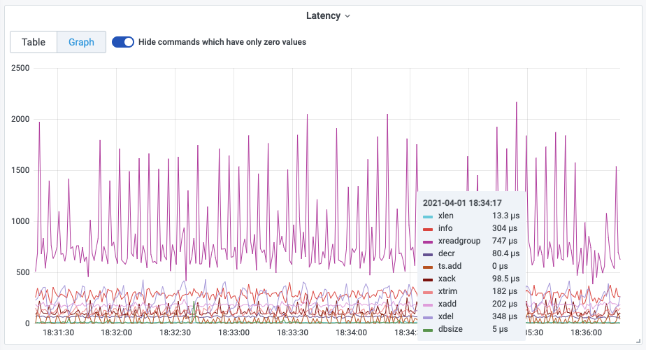
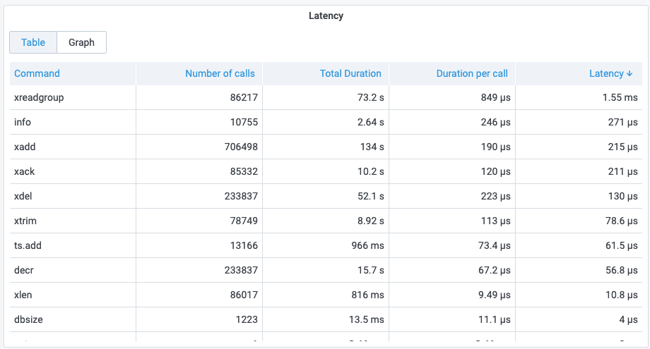

# Command Latency

Redis is often used in the context of demanding use cases, where it serves a large number of queries per second per instance, and at the same time, there are very strict latency requirements both for the average response time and for the worst case latency.

This panel provides commands's latency based on [INFO COMMANDSTATS](../redis-datasource/redis/INFO.md). Information is provide in Graph and table views.

## Graph view

## Table view

## Dashboard

This panel is included in [Redis CLI dashboard](dashboards.md).
