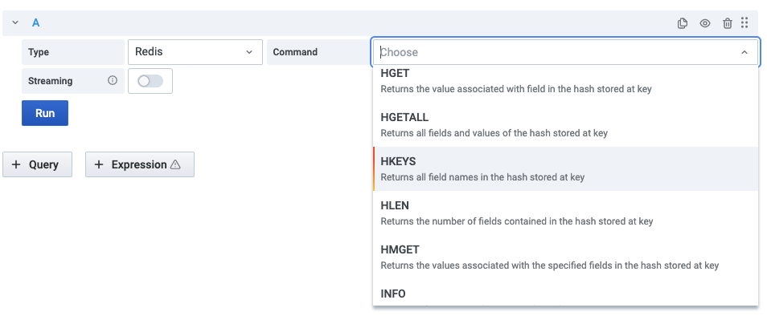

# Redis Data Source supports

Redis Data Source supports core Redis, custom and Redis Modules commands:

- [RedisTimeSeries](https://oss.redislabs.com/redistimeseries/) - Time Series data structure
- [RedisGears](https://oss.redislabs.com/redisgears/) - Dynamic framework for data processing
- [RedisGraph](https://oss.redislabs.com/redisgraph/) - Graph database
- [RediSearch](https://oss.redislabs.com/redisearch/) - Secondary Index & Query Engine

## Query Editor

Choose **Type**, **Command**, enable [Streaming](streaming.md) if required and provide all required parameters:

## Core (Hashes, Sets, Lists, Strings, Streams, etc.)

- CLIENT LIST - Returns information and statistics about the client connections server
- CLUSTER INFO - Provides INFO style information about Redis Cluster vital parameters
- CLUSTER NODES - Provides current cluster configuration, given by the set of known nodes
- GET - Returns the value of key
- HGET - Returns the value associated with field in the hash stored at key
- HGETALL - Returns all fields and values of the hash stored at key
- HKEYS - Returns all field names in the hash stored at key
- HLEN - Returns the number of fields contained in the hash stored at key
- HMGET - Returns the values associated with the specified fields in the hash stored at key
- [INFO](redis/INFO.md) - Returns information and statistics about the server
- LLEN - Returns the length of the list stored at key
- SCARD - Returns the set cardinality (number of elements) of the set stored at key
- SLOWLOG GET - Returns the Redis slow queries log
- SMEMBERS - Returns all the members of the set value stored at key
- TTL - Returns the string representation of the type of the value stored at key
- TYPE - Returns the string representation of the type of the value stored at key
- XINFO STREAM - Returns general information about the stream stored at the specified key
- XLEN - Returns the number of entries inside a stream
- XRANGE - Returns the stream entries matching a given range of IDs
- XREVRANGE - Returns the stream entries matching a given range of IDs in reverse order

## Custom

- [TMSCAN](custom/TMSCAN.md) - Returns keys with types and memory usage

## RedisTimeSeries

- TS.GET - Returns the last sample
- TS.INFO - Returns information and statistics on the time-series
- TS.MRANGE - Query a timestamp range across multiple time-series by filters
- TS.QUERYINDEX - Query all the keys matching the filter list
- [TS.RANGE](redis-timeseries/TS-RANGE.md) - Query a range

## RedisGears

- RG.DUMPREGISTRATIONS - Outputs the list of function registrations
- RG.PYSTATS - Returns memory usage statistics from the Python interpreter

## RedisGraph

- GRAPH.QUERY - Executes the given query against a specified graph
- GRAPH.SLOWLOG - Returns a list containing up to 10 of the slowest queries issued against the given graph ID

## RediSearch

- FT.INFO - Returns information and statistics on the index
