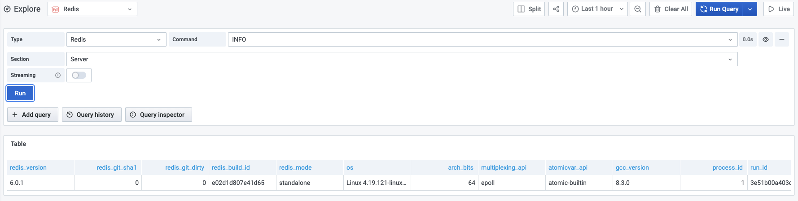

# Supported Commands

Redis Data Source supports core Redis, Custom and Redis Modules commands to use in the Query Editor and Explore.

## Query Editor

1. Choose **Type** to select core Redis, Custom or Redis Module
2. Select one of supported **Command**s
3. Provide all required parameters, depends on selected **Command**
4. Enable [Streaming](streaming.md) if required

## Explore

> Grafana’s dashboard UI is all about building dashboards for visualization. Explore strips away the dashboard and panel options so that you can focus on the query. It helps you iterate until you have a working query and then think about building a dashboard.

## Commands

### Redis (Hashes, Sets, Lists, Strings, Streams, etc.)

| Command                             | Description                                                                       |
| ----------------------------------- | --------------------------------------------------------------------------------- |
| [CLIENT LIST](redis/CLIENT-LIST.md) | Returns information and statistics about the client connections server            |
| CLUSTER INFO                        | Provides INFO style information about Redis Cluster vital parameters              |
| CLUSTER NODES                       | Provides current cluster configuration, given by the set of known nodes           |
| [GET](redis/GET.md)                 | Returns the value of key                                                          |
| HGET                                | Returns the value associated with field in the hash stored at key                 |
| HGETALL                             | Returns all fields and values of the hash stored at key                           |
| HKEYS                               | Returns all field names in the hash stored at key                                 |
| [HLEN](redis/HLEN.md)               | Returns the number of fields contained in the hash stored at key                  |
| HMGET                               | Returns the values associated with the specified fields in the hash stored at key |
| [INFO](redis/INFO.md)               | Returns information and statistics about the server                               |
| [LLEN](redis/LLEN.md)               | Returns the length of the list stored at key                                      |
| [SCARD](redis/SCARD.md)             | Returns the set cardinality (number of elements) of the set stored at key         |
| [SLOWLOG GET](redis/SLOWLOG-GET.md) | Returns the Redis slow queries log                                                |
| [SMEMBERS](redis/SMEMBERS.md)       | Returns all the members of the set value stored at key                            |
| [TTL](redis/TTL.md)                 | Returns the remaining time to live of a key that has a timeout                    |
| [TYPE](redis/TYPE.md)               | Returns the string representation of the type of the value stored at key          |
| XINFO STREAM                        | Returns general information about the stream stored at the specified key          |
| [XLEN](redis/XLEN.md)               | Returns the number of entries inside a stream                                     |
| XRANGE                              | Returns the stream entries matching a given range of IDs                          |
| XREVRANGE                           | Returns the stream entries matching a given range of IDs in reverse order         |

### Custom

| Command                    | Description                              |
| -------------------------- | ---------------------------------------- |
| [TMSCAN](custom/TMSCAN.md) | Returns keys with types and memory usage |

### RedisTimeSeries

> [RedisTimeSeries](https://oss.redislabs.com/redistimeseries/) is a Redis Module adding a Time Series data structure to Redis.

| Command                                            | Description                                                    |
| -------------------------------------------------- | -------------------------------------------------------------- |
| [TS.GET](redis-timeseries/TS-GET.md)               | Returns the last sample                                        |
| [TS.INFO](redis-timeseries/TS-INFO.md)             | Returns information and statistics on the time-series          |
| [TS.MRANGE](redis-timeseries/TS-MRANGE.md)         | Query a timestamp range across multiple time-series by filters |
| [TS.QUERYINDEX](redis-timeseries/TS-QUERYINDEX.md) | Query all the keys matching the filter list                    |
| [TS.RANGE](redis-timeseries/TS-RANGE.md)           | Query a range                                                  |

### RedisGears

> [RedisGears](https://oss.redislabs.com/redisgears/) is a serverless engine for transaction, batch and event-driven data processing in Redis.

| Command                                                     | Description                                                 |
| ----------------------------------------------------------- | ----------------------------------------------------------- |
| [RG.DUMPREGISTRATIONS](redis-gears/RG-DUMPREGISTRATIONS.md) | Outputs the list of function registrations                  |
| [RG.PYEXECUTE](redis-gears/RG-PYEXECUTE.md)                 | Executes a Python function                                  |
| [RG.PYSTATS](redis-gears/RG-PYSTATS.md)                     | Returns memory usage statistics from the Python interpreter |

### RedisGraph

> [RedisGraph](https://oss.redislabs.com/redisgraph/) is the first queryable Property Graph database to use sparse matrices to represent the adjacency matrix in graphs and linear algebra to query the graph.

| Command                                       | Description                                                                                 |
| --------------------------------------------- | ------------------------------------------------------------------------------------------- |
| [GRAPH.QUERY](redis-graph/GRAPH-QUERY.md)     | Executes the given query against a specified graph                                          |
| [GRAPH.SLOWLOG](redis-graph/GRAPH-SLOWLOG.md) | Returns a list containing up to 10 of the slowest queries issued against the given graph ID |

### RediSearch

> [RediSearch](https://oss.redislabs.com/redisearch/) is a source available Secondary Index, Query Engine and Full-Text Search over Redis.

| Command                            | Description                                     |
| ---------------------------------- | ----------------------------------------------- |
| [FT.INFO](redis-search/FT-INFO.md) | Returns information and statistics on the index |
