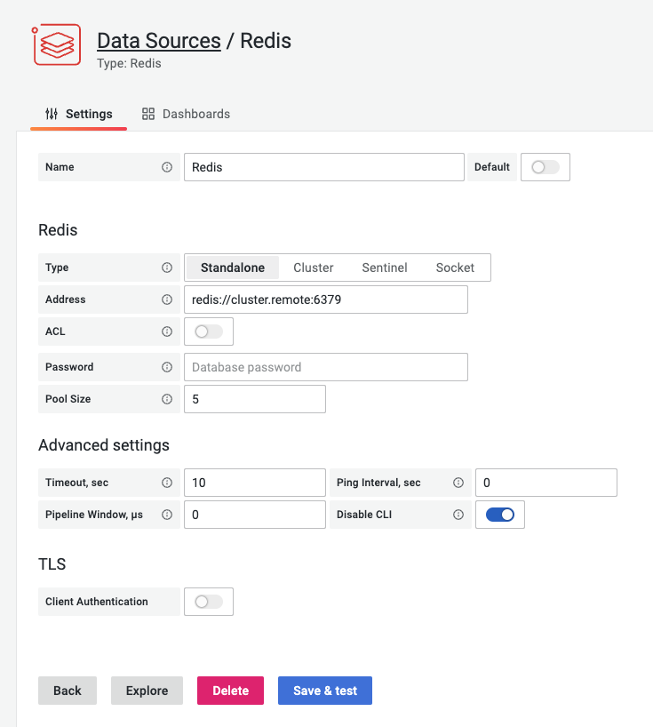
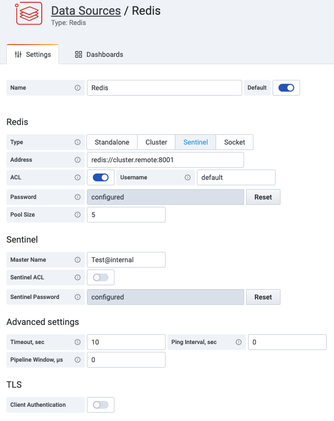

# Configuration

You can add as many data sources as you want to support multiple Redis databases.



Redis accepts clients connections on the configured [listening TCP port](#standalone) and the [Unix socket](#unix-socket) if enabled. [Cluster](#cluster) is a distributed implementation of OSS Redis and [Sentinel](#sentinel) provides high availability.

## Main configuration

### Address

Specify `host:port` address or a URI to connect to Redis. Please use `/db-number` or `?db=db-number` to specify the logical database number as defined in the [Schema](https://www.iana.org/assignments/uri-schemes/prov/redis):

```bash
redis://redis-server:6379/0
```

#### Cluster

- For redundancy provide multiple `host:port` addresses or URIs comma separated.

#### Sentinel

- **Address** can contain multiple values (`host:port` address or a URI) with comma.
- **Master Name** is required to connect to the Sentinel and open Redis connections.

!!! important "Authentication"

    Redis Data Source 1.5.0 will introduce separate password and ACL settings for Sentinel. Prior version has limitation of the same password for Sentinel and Redis instances.



#### Unix socket

In Unix socket mode **Address** should contain path to the socket file.

### ACL

Available since [Redis 6.0](https://redis.io/topics/acl) and allows to specify **Username** to authenticate.


### Password

!!! important "Security"

    Passwords are kept in the Grafana security database and not accessible to users.

When specified AUTH command will be used to authenticate with the provided password.

### Pool Size

Data source will keep open at least the given number of connections to the Redis instance at the provided **Address**. The recommended size of the pool is 5 and can be increased if dashboards have a lot of panels and multiple users.

## Advanced configuration

### Timeout

Sets the duration in seconds for connect, read and write timeouts. Default value is 10 seconds.

### Ping Interval

Specifies the interval in seconds at which a ping event happens. A shorter interval means connections are pinged more frequently, but also means more traffic with the server. If interval is zero then ping will be disabled. Default value is 0.

### Pipeline Window

Sets the duration in microseconds after which internal pipelines will be flushed. If window is zero then implicit pipelining will be disabled. Default value is 0.

## SSL/TLS

To support SSL/TLS authentication enable it and provide all required parameters.


### Skip Verify

If checked, the server's certificate will not be checked for validity. Should be enabled for Self-Signed certificates.

### Client Certificate and Key

!!! important "Security"

    Client certificates and keys are kept in the Grafana security database and not accessible to users.

Client Certificate and Key should be provided when client authentication is enforced.

### Certification Authority

Provide certificate to validate server's certificate or enable **Skip Verify**.
