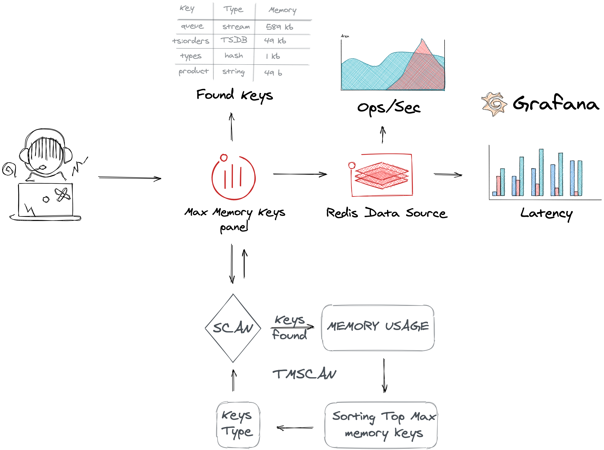
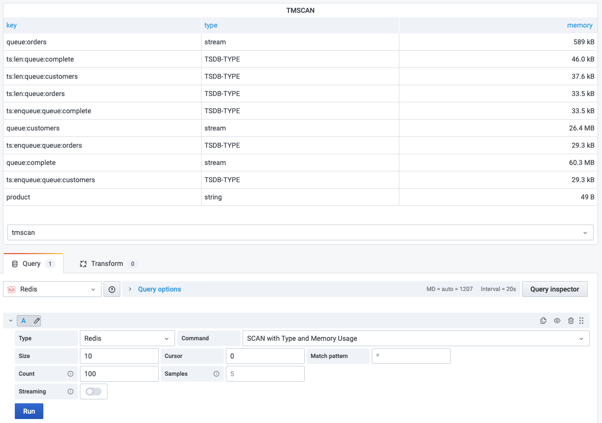

# TMSCAN

Returns keys with types and memory usage. This custom command is based on SCAN and MEMORY USAGE commands and is not a part of Redis server.

> [SCAN](https://redis.io/commands/scan) is a cursor based iterator. This means that at every call of the command, the server returns an updated cursor that the user needs to use as the cursor argument in the next call.

> The [MEMORY USAGE](https://redis.io/commands/memory-usage) command reports the number of bytes that a key and its value require to be stored in RAM.

!!! warning "Latency"

    Please use this command in OFF-PEAK as it cause latency increase.

Found results and Cursor returns in separate frames.

## Parameters

| Parameter     | Description                                                                                                             |
| ------------- | ----------------------------------------------------------------------------------------------------------------------- |
| Size          | Calculate top keys in the results                                                                                       |
| Cursor        | Iterator for SCAN command                                                                                               |
| Match pattern | Pattern for SCAN command                                                                                                |
| Count         | The amount of work that should be done at every call in order to retrieve elements from the collection for SCAN command |
| Samples       | Number of sampled nested values for MEMORY USAGE command                                                                |

## Streaming

Streaming is not supported.

## Visualization

- Table
- [Keys consuming a lot of memory](../../redis-app/panels/redis-keys-panel.md) panel
