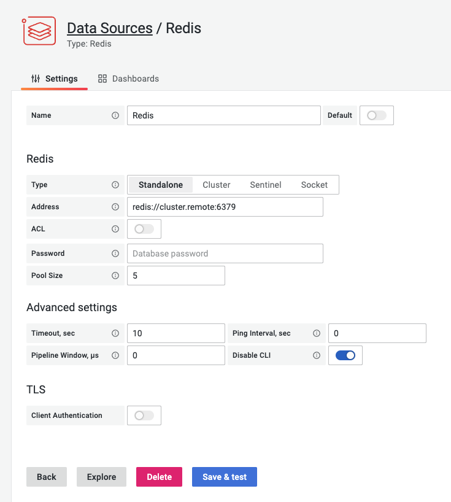

# Redis Data Source

Data Source allows connecting to any Redis database On-Premises and in the Cloud.

!!! tip "Redis Application plugin"

    The [Redis Application plugin](../redis-app/overview.md) helps manage multiple Redis Data Sources and provides Custom panels.

!!! note "Redis Explorer plugin"

    The [Redis Explorer plugin](https://grafana.com/grafana/plugins/redis-explorer-app) connects to Redis Enterprise software clusters using REST API. It provides application pages to add Redis Data Sources for managed databases and dashboards to see cluster configuration.

## Quickstart

To learn how to install Redis Data Source using `grafana-cli`, run using Docker or manually without Internet access follow the [Quickstart](../quickstart.md) page.

## Configuration

The [Configuration](configuration.md) page explains how to connect a data source to the Redis database.

## Query Editor

1. Choose **Type** to select core Redis, Custom, or Redis Module
2. Select one of the supported [Commands](commands.md)
3. Provide all required parameters, depends on the **Command** chosen
4. Enable [Streaming](streaming.md) to visualize data on Graph, Time-Series (Grafana 7.4+) panels

## Variables

[Template variables](variables.md) can query any command which returns a list of values and use other variables as parameters.

## Supported platforms

Redis Data Source is based on the [Grafana plugin SDK for Go](https://grafana.com/docs/grafana/latest/developers/plugins/backend/grafana-plugin-sdk-for-go/) and supports

- Linux on AMD64, ARM and ARM64
- MacOS (Darwin) on AMD64 and ARM64 (M1)
- Windows on AMD64

Other platforms are not supported and may be introduced in future.

## Provisioning

Grafana supports managing data sources by [adding one or more YAML config files](https://grafana.com/docs/grafana/latest/administration/provisioning/) in the **provisioning/datasources** directory:

- Each config file can contain a list of data sources that will get added or updated during start up.
- If the data source already exists, Grafana updates it to match the configuration file.

=== "Standalone"

    ---8<-- "includes/redis-datasource/config/standalone-yaml.md"

=== "Sentinel"

    ---8<-- "includes/redis-datasource/config/sentinel-yaml.md"

## Known issues

### Plugin health check failed

Redis Data Source binaries should have executable permissions for Grafana to execute it. Check out the [Quickstart](../quickstart.md#install-without-internet-access) page for more information.

### `Redis_datasource_darwin_amd64` cannot be opened because the developer cannot be verified

Go to `System Preferences` > `Security & Privacy` and set to allow `redis-datasource_darwin_amd64`.
