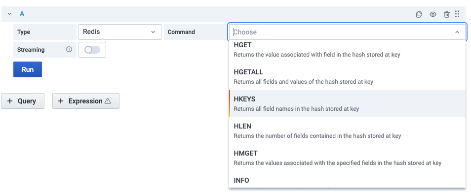

# Redis Data Source

 

Data Source allows to connect to any Redis database On-Premises or in the Cloud.

!!! tip "Redis Application plug-in"

    [Redis Application plug-in](../redis-app/overview.md) helps to manage multiple Redis Data Sources and provides Custom panels.

## Configuration

The [Configuration](configuration.md) page explains how to connect data source to Redis database.

## Query Editor

1. Choose **Type** to select core Redis, Custom or Redis Module
2. Select one of supported [Commands](commands.md)
3. Provide all required parameters, depends on selected **Command**
4. Enable [Streaming](streaming.md) to visualize data on Graph, Time-Series (Grafana 7.4+) panels

## Variables

[Template variables](variables.md) can query any command which return list of values and use other variables as parameters.

## Provisioning

Grafana supports managing data sources by [adding one or more YAML config files](https://grafana.com/docs/grafana/latest/administration/provisioning/) in the **provisioning/datasources** directory:

- Each config file can contain a list of datasources that will get added or updated during start up.
- If the data source already exists, then Grafana updates it to match the configuration file.

=== "Standalone"

    ---8<-- "includes/redis-datasource/config/standalone-yaml.md"

=== "Sentinel"

    ---8<-- "includes/redis-datasource/config/sentinel-yaml.md"

## Known issues

### Plugin health check failed

Redis Data Source binaries should have executable permissions for Grafana to be able to execute it. Check out [Quickstart](../quickstart.md#install-without-internet-access) page for more information.

### `Redis_datasource_darwin_amd64` cannot be opened because the developer cannot be verified

Go to `System Preferences` > `Security & Privacy` and set to allow `redis-datasource_darwin_amd64`.
