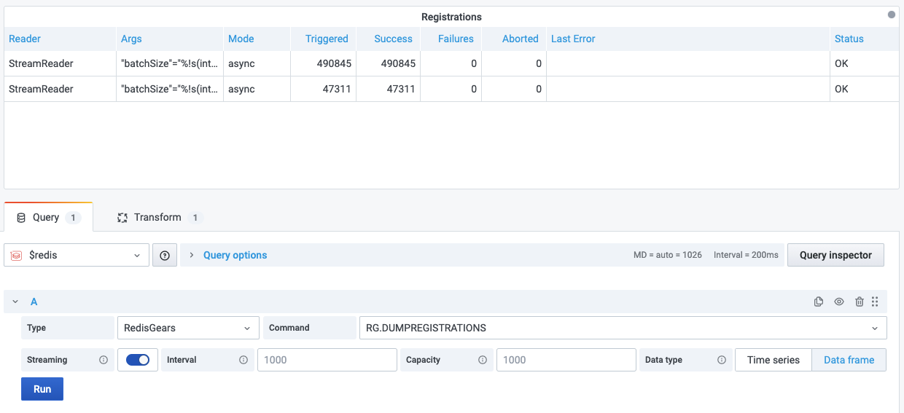
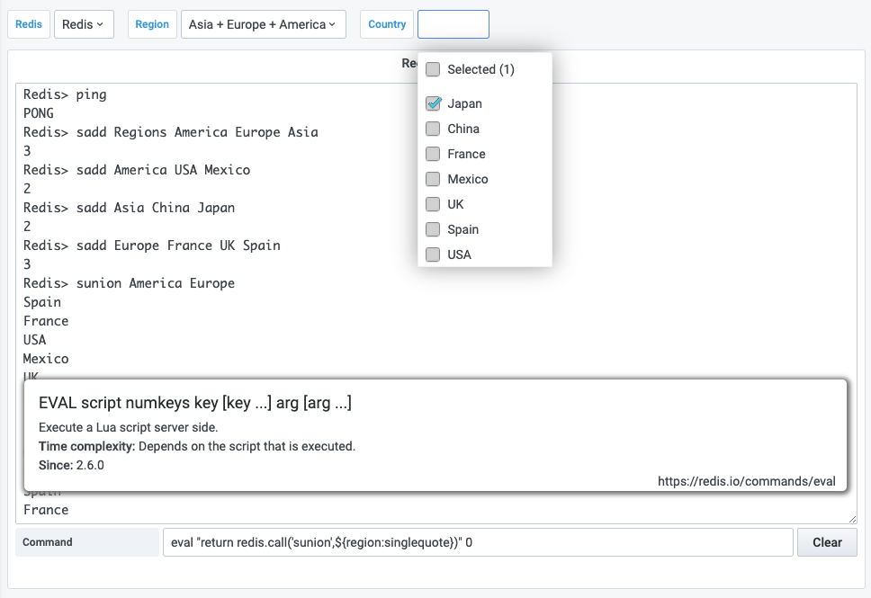

# Redis Data Source

 [](https://grafana.com/grafana/plugins/redis-datasource)

Data Source allows to connect to any Redis database On-Premises or in the Cloud.

!!! tip "Redis Application plug-in"

    [Redis Application plug-in](../redis-app/overview.md) helps to manage multiple Redis Data Sources and provides Custom panels.

## Configuration

The [Configuration](configuration.md) page explains how to connect data source to Redis database.


## Query Editor

1. Choose **Type** to select core Redis, Custom or Redis Module
2. Select one of supported [Commands](commands.md)
3. Provide all required parameters, depends on selected **Command**
4. Enable [Streaming](#streaming) to visualize data on Graph, Time-Series (Grafana 7.4+) panels


## Streaming

Redis Data Source supports Streaming. Please take a look at the [specific command](commands.md) for details.

!!! note "A dot in the top right corner"

    Since Grafana 7.4 a dot in the top right corner means that Streaming is enabled.


### Parameters

| Parameter | Description                                                              | Default     |
| --------- | ------------------------------------------------------------------------ | ----------- |
| Interval  | Streaming interval in milliseconds                                       | 1000 ms     |
| Capacity  | Values will be constantly added and will never exceed the given capacity | 1000 ms     |
| Data type | Streaming data supported as Time series and Data frames                  | Time series |

### Time series

When selected, `time` field will be added or replaced to allow visualize values using Graph or Time Series (Grafana 7.4+) panels.

!!! important "Multi-line results"

    If the command returns more than one line, the last line of data will be returned.


### Data frame

When selected, data will be refreshed as is.



## Variables

Template variables can query [Commands](commands.md) and use other variables as parameters.


### Supported Parameters

Variables will be replaced in the following parameters:

| Parameter | Description  | Command                                                                                        |
| --------- | ------------ | ---------------------------------------------------------------------------------------------- |
| Key       | Key name     | [GET](redis/GET.md), XRANGE, etc.                                                              |
| Query     | CLI query    | Any                                                                                            |
| Field     | Hash Field   | HGET, HMGET                                                                                    |
| Filter    | Filter       | [TS.MRANGE](redis-timeseries/TS-MRANGE.md), [TS.QUERYINDEX](redis-timeseries/TS-QUERYINDEX.md) |
| Legend    | Frame's name | [TS.RANGE](redis-timeseries/TS-RANGE.md)                                                       |
| Value     | Serie's name | [TS.RANGE](redis-timeseries/TS-RANGE.md)                                                       |

### How to use SUNION for multi-select variable?

=== "LUA"

    The LUA script should work fine on a single shard deployment:

    ```bash
    eval "return redis.call('sunion',${region:singlequote})" 0
    ```

=== "Redis Gears"

    Another option is to utilize [RedisGears](https://redisgears.io) module:

    --8<-- "includes/redis-datasource/gears-sunion.md"

    To execute the trigger in Grafana:

    ```bash
    RG.TRIGGER SUNION ${region:csv}
    ```



## Privisioning

Grafana supports managing data sources by [adding one or more YAML config files](https://grafana.com/docs/grafana/latest/administration/provisioning/) in the **provisioning/datasources** directory:

- Each config file can contain a list of datasources that will get added or updated during start up.
- If the data source already exists, then Grafana updates it to match the configuration file.

=== "Standalone"

    ---8<-- "includes/redis-datasource/config/standalone-yaml.md"

=== "Sentinel"

    ---8<-- "includes/redis-datasource/config/sentinel-yaml.md"

## Known issues

### Plugin health check failed

Redis Data Source binaries should have executable permissions for Grafana to be able to execute it. Check out [Quickstart](../quickstart.md#install-without-internet-access) page for more information.

### `Redis_datasource_darwin_amd64` cannot be opened because the developer cannot be verified

Go to `System Preferences` > `Security & Privacy` and set to allow `redis-datasource_darwin_amd64`.
