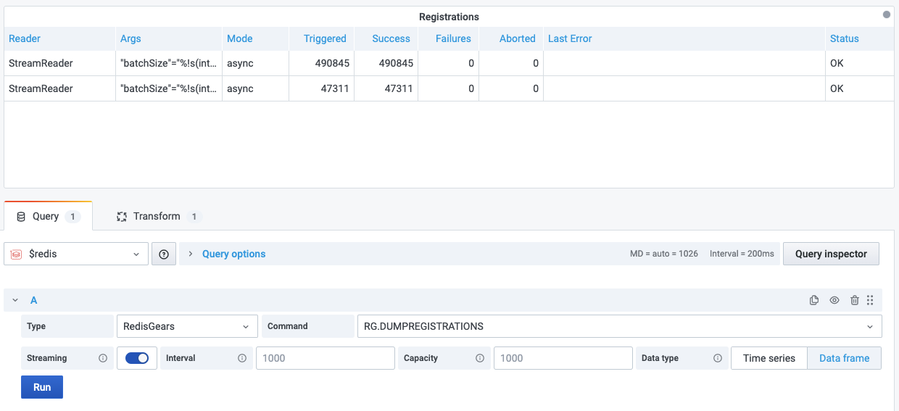

# RG.DUMPREGISTRATIONS

Outputs the list of function registrations.

> The representation of an event-driven function is called a [registration](https://oss.redislabs.com/redisgears/functions.html#registration).

!!! info "RedisGears"

    [https://oss.redislabs.com/redisgears/commands.html#rgdumpregistrations](https://oss.redislabs.com/redisgears/commands.html#rgdumpregistrations)

## Parameters

No parameters is required.

## Streaming

Streaming is supported as **Data frame**.

## Visualization

- Table

## Dashboards

- [RedisGears](../../redis-app/dashboards/redis-gears.md) includes Table panel **Registrations** using this command.
