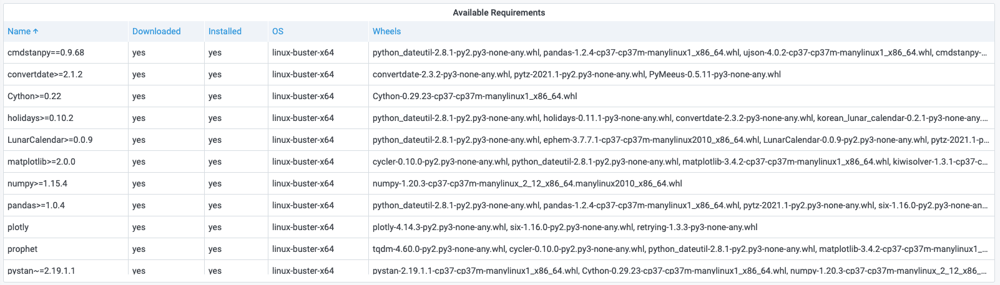

# RG.PYDUMPREQS

This command returns a list of all the python requirements available (with information about each requirement).

!!! info "RedisGears"

    [https://oss.redislabs.com/redisgears/commands.html#rgpydumpreqs](https://oss.redislabs.com/redisgears/commands.html#rgpydumpreqs)

## Parameters

No parameters is required.

## Streaming

Streaming supported as **Data frame**.

## Visualization

- Table

## Dashboards

- [RedisGears](../../redis-app/dashboards/redis-gears.md) includes Table panel **Available Requirements** using this command.
