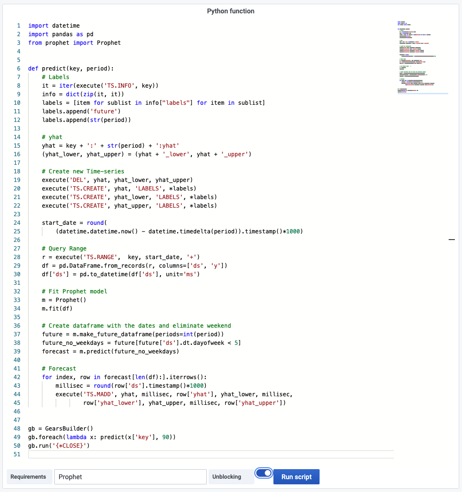

# RG.PYEXECUTE

This command executes a Python function.

> A RedisGears [function](https://oss.redislabs.com/redisgears/functions.html#function) is a formal description of the processing steps in the data flow.

!!! info "RedisGears"

    [https://oss.redislabs.com/redisgears/commands.html#rgpyexecute](https://oss.redislabs.com/redisgears/commands.html#rgpyexecute)

## Parameters

| Parameter    | Description                                                                                              |
| ------------ | -------------------------------------------------------------------------------------------------------- |
| Function     | Python function                                                                                          |
| Unblocking   | Doesn't block the client during execution                                                                |
| Requirements | Ensures that list of dependencies it is given as an argument is installed on each shard before execution |

## Streaming

Streaming is not supported.

## Visualization

This command is not available in Query Editor and can be used only using [RedisGears Script Editor](../../redis-app/panels/redis-gears-panel.md) panel.

## Dashboards

- [RedisGears](../../redis-app/dashboards/redis-gears.md) includes RedisGears Script Editor panel **Python function** using this command.
