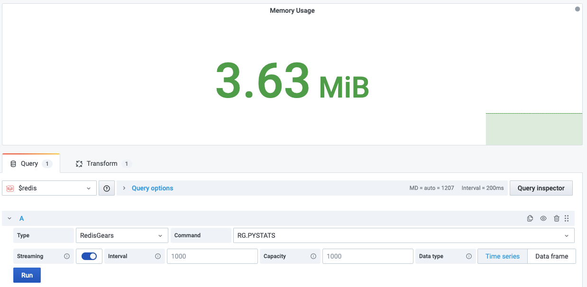

# RG.PYSTATS

This command returns memory usage statistics from the Python interpreter.

> RedisGears embeds a Python version 3.7.2+ [interpreter](https://oss.redislabs.com/redisgears/runtime.html#python-interpreter).

!!! info "RedisGears"

    [https://oss.redislabs.com/redisgears/commands.html#rgpystats](https://oss.redislabs.com/redisgears/commands.html#rgpystats)

## Parameters

No parameters is required.

## Streaming

Streaming supported as **Time Series** and **Data frame**.

## Visualization

Any standard visualization should work.

## Dashboards

- [RedisGears](../../redis-app/dashboards/redis-gears.md) includes Graph panel **Memory Usage** using this command.
