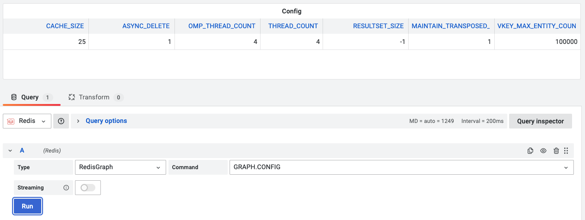

# GRAPH.CONFIG

This command retrieves a RedisGraph configuration.

!!! info "RedisGraph"

    [https://oss.redislabs.com/redisgraph/commands/#graphconfig](https://oss.redislabs.com/redisgraph/commands/#graphconfig)

## Parameters

No parameters is required.

--8<-- "includes/redis-datasource/streaming-any.md"

--8<-- "includes/redis-datasource/visualization-any.md"
