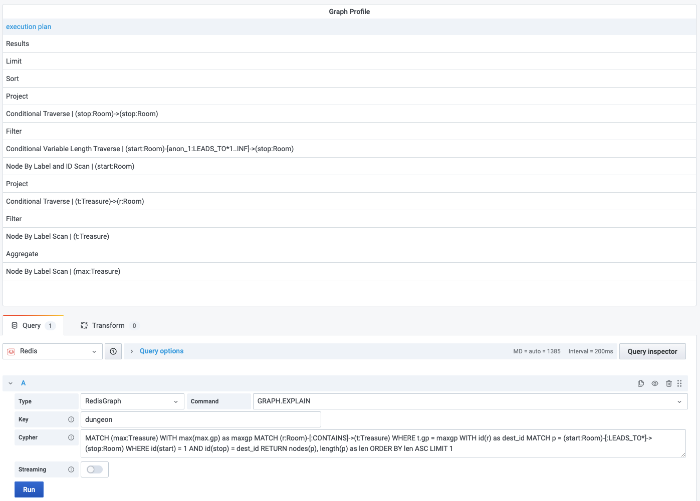

# GRAPH.EXPLAIN

This command constructs a query execution plan but does not run it.

!!! info "RedisGraph"

    [https://oss.redislabs.com/redisgraph/commands/#graphexplain](https://oss.redislabs.com/redisgraph/commands/#graphexplain)

## Parameters

| Parameter | Description                                                                                                                                           |
| --------- | ----------------------------------------------------------------------------------------------------------------------------------------------------- |
| Key       | RedisGraph key                                                                                                                                        |
| Cypher    | The [syntax is based on Cypher](https://oss.redislabs.com/redisgraph/commands/#query-language), and only a subset of the language currently supported |

## Streaming

Streaming supported as **Data frame**.

## Visualization

- Table
