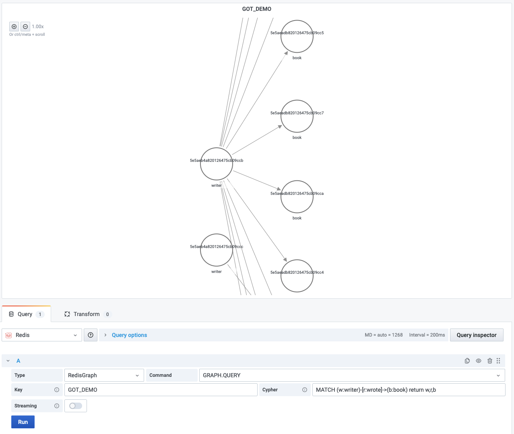
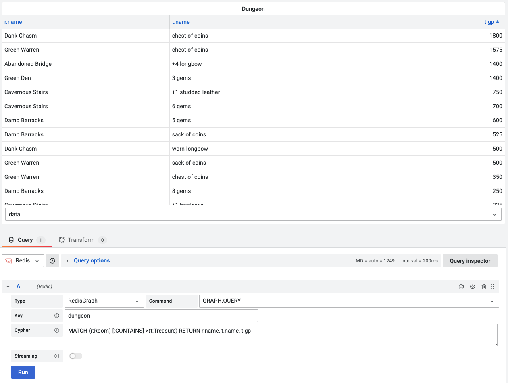

# GRAPH.QUERY

This command executes the given query against a specified graph.

!!! info "RedisGraph"

    [https://oss.redislabs.com/redisgraph/commands/#graphquery](https://oss.redislabs.com/redisgraph/commands/#graphquery)

--8<-- "includes/ds-timeout.md"

## Parameters

| Parameter | Description                                                                                                                                           |
| --------- | ----------------------------------------------------------------------------------------------------------------------------------------------------- |
| Key       | Key name                                                                                                                                              |
| Cypher    | The [syntax is based on Cypher](https://oss.redislabs.com/redisgraph/commands/#query-language), and only a subset of the language currently supported |

## Data Frames

Depends on the **Cypher** this command will return

| Name     | Description                                                                                                         |
| -------- | ------------------------------------------------------------------------------------------------------------------- |
| nodes    | Nodes in the [Node Graph panel](https://grafana.com/docs/grafana/latest/panels/visualizations/node-graph/)'s format |
| edges    | Edges in the [Node Graph panel](https://grafana.com/docs/grafana/latest/panels/visualizations/node-graph/)'s format |
| data     | Formatted data returned by the query                                                                                |
| metadata | Metadata related to the query execution                                                                             |

## Streaming

Streaming is not supported.

## Visualization

- Node Graph ([Grafana 7.4+](https://grafana.com/docs/grafana/latest/whatsnew/whats-new-in-v7-4/))
