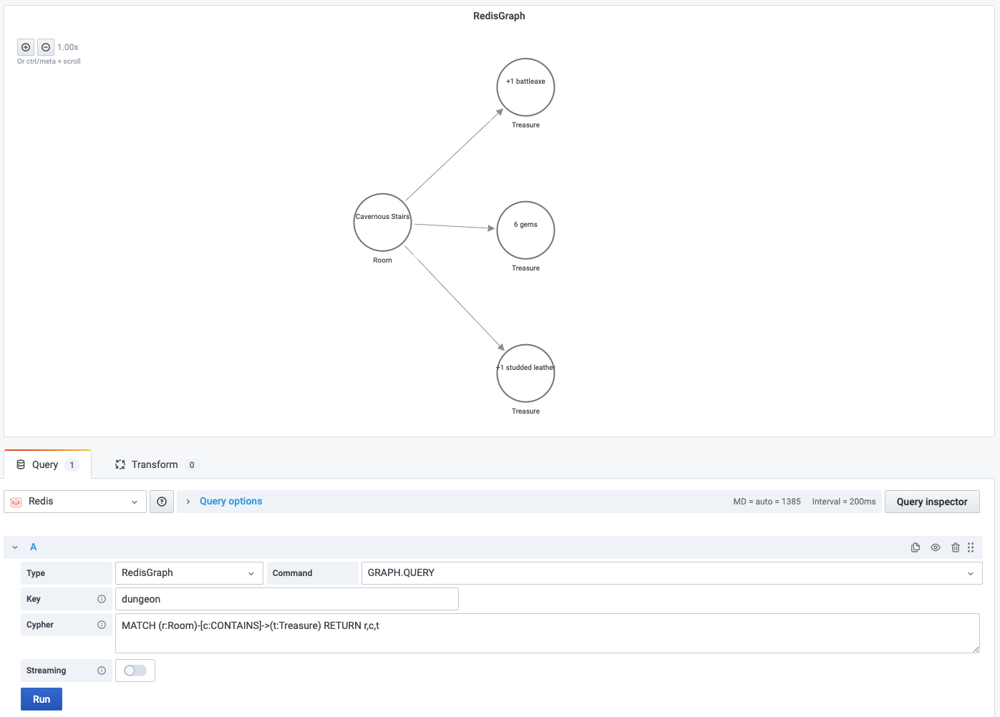

# GRAPH.QUERY

This command executes the given query against a specified graph.

!!! info "RedisGraph"

    [https://oss.redislabs.com/redisgraph/commands/#graphquery](https://oss.redislabs.com/redisgraph/commands/#graphquery)

## Parameters

| Parameter | Description                                                                                                                                           |
| --------- | ----------------------------------------------------------------------------------------------------------------------------------------------------- |
| Key       | Key name                                                                                                                                              |
| Cypher    | The [syntax is based on Cypher](https://oss.redislabs.com/redisgraph/commands/#query-language), and only a subset of the language currently supported |

## Streaming

Streaming supported as **Data frame**.

## Visualization

- Node Graph (Grafana 7.4+)
