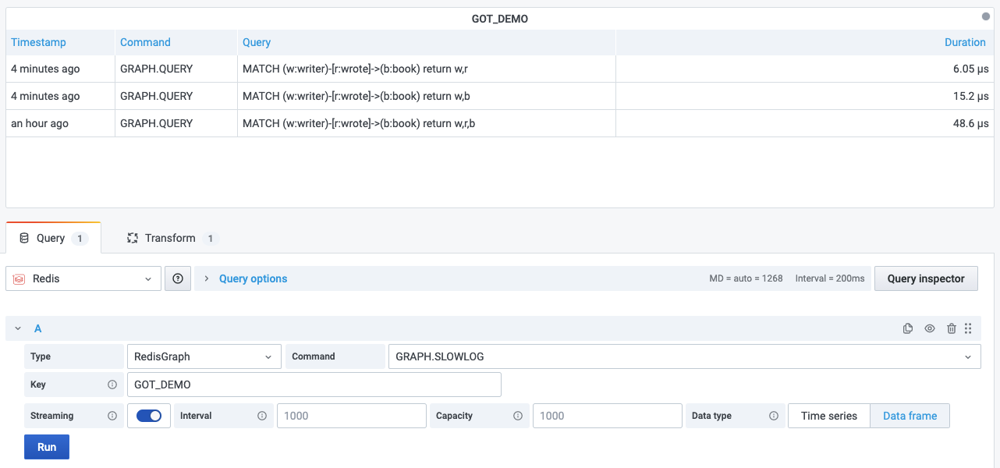

# GRAPH.SLOWLOG

This command returns a list containing up to 10 of the slowest queries issued against the given graph ID.

!!! info "RedisGraph"

    [https://oss.redislabs.com/redisgraph/commands/#graphslowlog](https://oss.redislabs.com/redisgraph/commands/#graphslowlog)

## Parameters

No parameters is required.

## Streaming

Streaming supported as **Data frame**.

## Visualization

- Table
