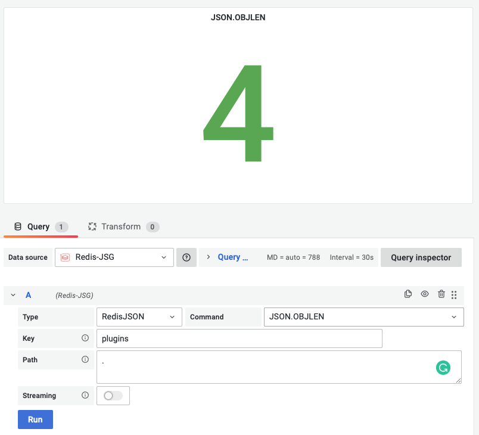

# JSON.OBJLEN

This command returns the number of keys in the JSON Object at path in key.

!!! info "RedisJSON"

    [https://oss.redis.com/redisjson/commands/#jsonobjlen](https://oss.redis.com/redisjson/commands/#jsonobjlen)

## Parameters

| Parameter | Description                                                            |
| --------- | ---------------------------------------------------------------------- |
| Key       | Key name                                                               |
| Path      | Subset of common best practices and resembles JSONPath not by accident |

--8<-- "includes/redis-datasource/json-path.md"

--8<-- "includes/redis-datasource/streaming-any.md"

--8<-- "includes/redis-datasource/visualization-any.md"
