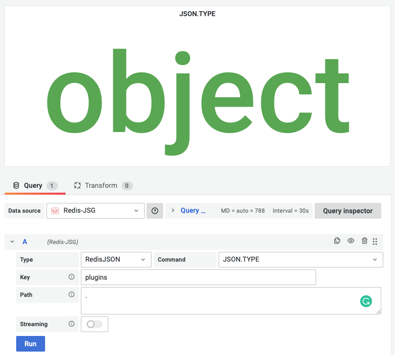

# JSON.TYPE

This command returns the type of JSON value at path.

!!! info "RedisJSON"

    [https://redis.io/commands/json.type/](https://redis.io/commands/json.type/)

## Parameters

| Parameter | Description                                                            |
| --------- | ---------------------------------------------------------------------- |
| Key       | Key name                                                               |
| Path      | Subset of common best practices and resembles JSONPath not by accident |

--8<-- "includes/redis-datasource/json-path.md"

--8<-- "includes/redis-datasource/streaming-any.md"

--8<-- "includes/redis-datasource/visualization-any.md"
