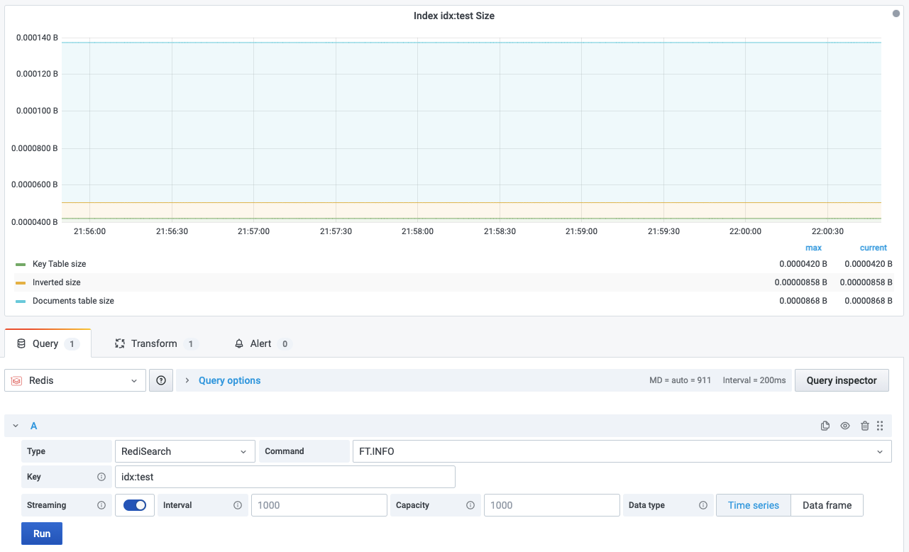

# FT.INFO

This command returns information and statistics on the index.

!!! info "RediSearch"

    [https://oss.redis.com/redisearch/1.6/Commands/#ftinfo](https://oss.redis.com/redisearch/1.6/Commands/#ftinfo)

## Parameters

| Parameter | Description |
| --------- | ----------- |
| Key       | Index       |

--8<-- "includes/redis-datasource/streaming-any.md"

--8<-- "includes/redis-datasource/visualization-any.md"
