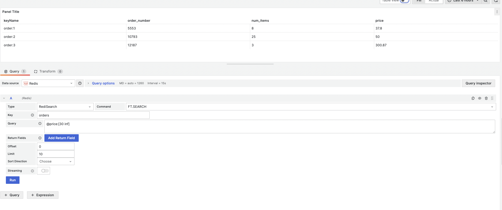

# FT.SEARCH

This command queries a secondary index for 

!!! info "RediSearch"

    [https://redis.io/commands/ft.search](https://redis.io/commands/ft.search)

## Parameters

| Parameter      | Description                                                                               |
| ---------      | -----------                                                                               |
| Key            | The index to search                                                                       |
| Query          | The [query](https://redis.io/docs/interact/search-and-query/query/) to use in the search. |
| Return Fields  | The fields the index to pull back for matching documents.                                 |
| Offset         | The offset into the result set to start from.                                             |
| Limit          | The number of documents to pull back from the result set.                                 |
| Sort Direction | The direction to sort the results.                                                        |
| Sort By        | The field to sort the results by                                                          |

--8<-- "includes/redis-datasource/streaming-any.md"

--8<-- "includes/redis-datasource/visualization-any.md"
