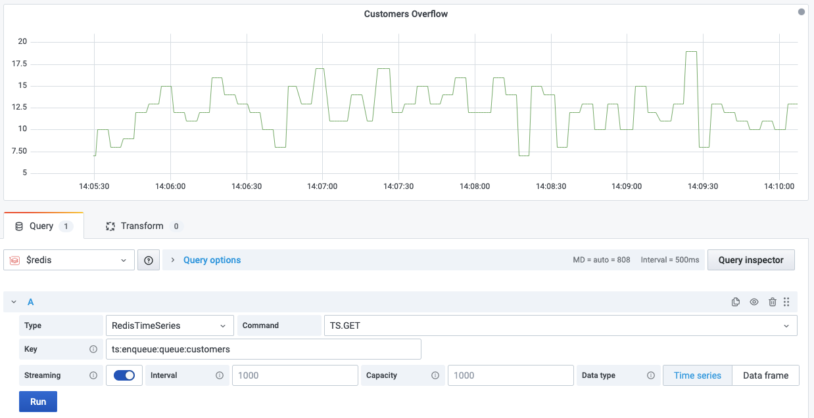

# TS.GET

This command returns the last sample.

!!! info "RedisTimeSeries"

    [https://oss.redislabs.com/redistimeseries/commands/#tsget](https://oss.redislabs.com/redistimeseries/commands/#tsget)

## Parameters

| Parameter | Description |
| --------- | ----------- |
| Key       | Key name    |

--8<-- "includes/redis-datasource/streaming-any.md"

--8<-- "includes/redis-datasource/visualization-any.md"
