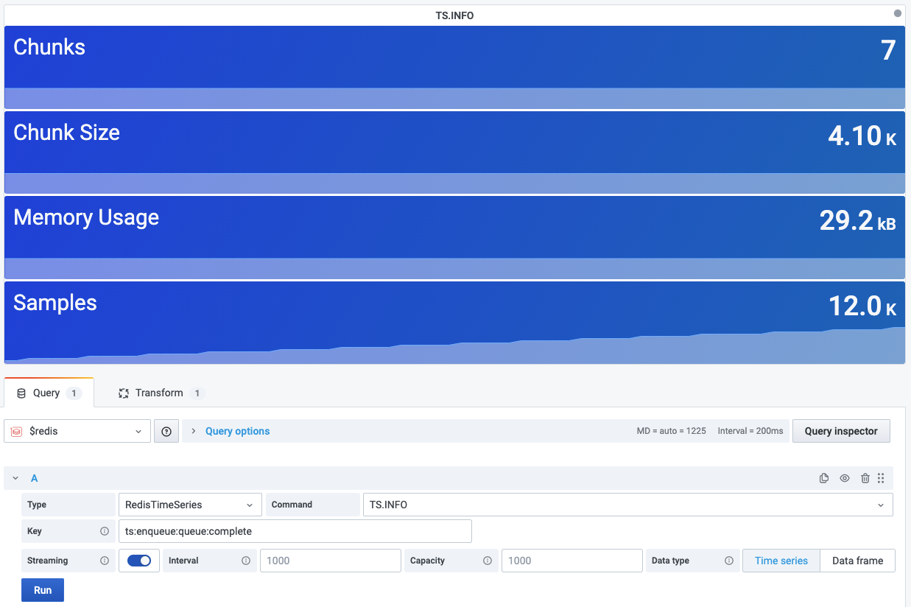

# TS.INFO

This command returns information and statistics on the time series.

!!! info "RedisTimeSeries"

    [https://redis.io/commands/ts.info/](https://redis.io/commands/ts.info/)

## Parameters

| Parameter | Description |
| --------- | ----------- |
| Key       | Key name    |

--8<-- "includes/redis-datasource/streaming-any.md"

--8<-- "includes/redis-datasource/visualization-any.md"
