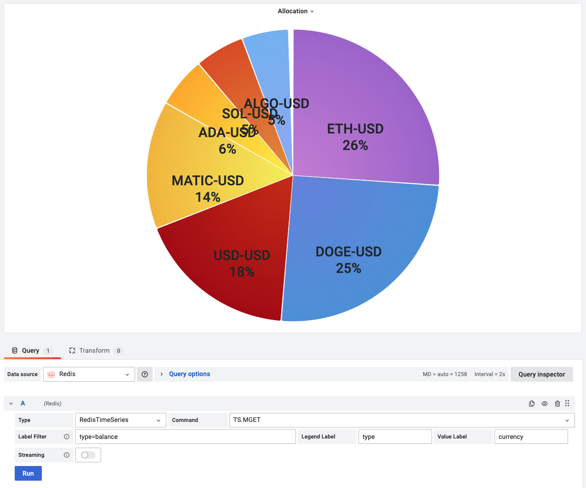

# TS.MGET

This command returns the last samples matching the specific filter.

!!! info "RedisTimeSeries"

    [https://redis.io/commands/ts.mget/](https://redis.io/commands/ts.mget/)

## Parameters

| Parameter    | Description                                                                                                           |
| ------------ | --------------------------------------------------------------------------------------------------------------------- |
| Label Filter | [Filters](https://oss.redis.com/redistimeseries/commands/#filtering). A minimum of one **l=v** filter must be applied |
| Legend Label | Label for Frame's name. Will be displayed for two or more time series                                                 |
| Value Label  | Label for Serie's name. Will be displayed in the legend                                                               |

## Streaming

Streaming is not supported.

--8<-- "includes/redis-datasource/visualization-any.md"
